<!-- markdownlint-capture -->
<!-- markdownlint-disable -->

# Code Metrics

This file is dynamically maintained by a bot, *please do not* edit this by hand. It represents various [code metrics](https://aka.ms/dotnet/code-metrics), such as cyclomatic complexity, maintainability index, and so on.

<div id='myjetwallet-b2c2-client'></div>

## MyJetWallet.B2C2.Client :x:

The *MyJetWallet.B2C2.Client.csproj* project file contains:

- 8 namespaces.
- 47 named types.
- 2,279 total lines of source code.
- Approximately 950 lines of executable code.
- The highest cyclomatic complexity is 12 :x:.

<details>
<summary>
  <strong id="myjetwallet-b2c2-client-autofac">
    MyJetWallet.B2C2.Client.Autofac :heavy_check_mark:
  </strong>
</summary>
<br>

The `MyJetWallet.B2C2.Client.Autofac` namespace contains 1 named types.

- 1 named types.
- 45 total lines of source code.
- Approximately 6 lines of executable code.
- The highest cyclomatic complexity is 3 :heavy_check_mark:.

<details>
<summary>
  <strong id="autofachelper">
    AutofacHelper :heavy_check_mark:
  </strong>
</summary>
<br>

- The `AutofacHelper` contains 2 members.
- 42 total lines of source code.
- Approximately 6 lines of executable code.
- The highest cyclomatic complexity is 3 :heavy_check_mark:.

| Member kind | Line number | Maintainability index | Cyclomatic complexity | Depth of inheritance | Class coupling | Lines of source / executable code |
| :-: | :-: | :-: | :-: | :-: | :-: | :-: |
| Method | <a href='https://github.com/MyJetWallet/MyJetWallet.B2C2.Client/blob/master/src/MyJetWallet.B2C2.Client/Autofac/AutofacHelper.cs#L15' title='void AutofacHelper.RegisterB2C2RestClient(ContainerBuilder builder, B2C2ClientSettings settings)'>15</a> | 78 | 3 :heavy_check_mark: | 0 | 6 | 19 / 3 |
| Method | <a href='https://github.com/MyJetWallet/MyJetWallet.B2C2.Client/blob/master/src/MyJetWallet.B2C2.Client/Autofac/AutofacHelper.cs#L35' title='void AutofacHelper.RegisterB2C2WebSocketClient(ContainerBuilder builder, B2C2ClientSettings settings)'>35</a> | 78 | 3 :heavy_check_mark: | 0 | 6 | 19 / 3 |

<a href="#AutofacHelper-class-diagram">:link: to `AutofacHelper` class diagram</a>

<a href="#myjetwallet-b2c2-client-autofac">:top: back to MyJetWallet.B2C2.Client.Autofac</a>

</details>

</details>

<details>
<summary>
  <strong id="myjetwallet-b2c2-client">
    MyJetWallet.B2C2.Client :x:
  </strong>
</summary>
<br>

The `MyJetWallet.B2C2.Client` namespace contains 5 named types.

- 5 named types.
- 1,244 total lines of source code.
- Approximately 496 lines of executable code.
- The highest cyclomatic complexity is 12 :x:.

<details>
<summary>
  <strong id="b2c2restclient">
    B2C2RestClient :x:
  </strong>
</summary>
<br>

- The `B2C2RestClient` contains 19 members.
- 615 total lines of source code.
- Approximately 248 lines of executable code.
- The highest cyclomatic complexity is 12 :x:.

| Member kind | Line number | Maintainability index | Cyclomatic complexity | Depth of inheritance | Class coupling | Lines of source / executable code |
| :-: | :-: | :-: | :-: | :-: | :-: | :-: |
| Field | <a href='https://github.com/MyJetWallet/MyJetWallet.B2C2.Client/blob/master/src/MyJetWallet.B2C2.Client/B2C2RestClient.cs#L21' title='HttpClient B2C2RestClient._httpClient'>21</a> | 100 | 0 :heavy_check_mark: | 0 | 1 | 1 / 0 |
| Field | <a href='https://github.com/MyJetWallet/MyJetWallet.B2C2.Client/blob/master/src/MyJetWallet.B2C2.Client/B2C2RestClient.cs#L22' title='ILogger<B2C2RestClient> B2C2RestClient._log'>22</a> | 100 | 0 :heavy_check_mark: | 0 | 1 | 1 / 0 |
| Method | <a href='https://github.com/MyJetWallet/MyJetWallet.B2C2.Client/blob/master/src/MyJetWallet.B2C2.Client/B2C2RestClient.cs#L24' title='B2C2RestClient.B2C2RestClient(B2C2ClientSettings settings, IHttpClientFactory clientFactory, ILogger<B2C2RestClient> logger)'>24</a> | 60 | 6 :heavy_check_mark: | 0 | 12 | 19 / 10 |
| Method | <a href='https://github.com/MyJetWallet/MyJetWallet.B2C2.Client/blob/master/src/MyJetWallet.B2C2.Client/B2C2RestClient.cs#L44' title='Task<IReadOnlyDictionary<string, decimal>> B2C2RestClient.BalanceAsync(CancellationToken ct = null)'>44</a> | 59 | 1 :heavy_check_mark: | 0 | 8 | 30 / 13 |
| Method | <a href='https://github.com/MyJetWallet/MyJetWallet.B2C2.Client/blob/master/src/MyJetWallet.B2C2.Client/B2C2RestClient.cs#L606' title='void B2C2RestClient.CheckForErrorInResponse(string response, HttpStatusCode status, Guid guid)'>606</a> | 67 | 2 :heavy_check_mark: | 0 | 7 | 22 / 7 |
| Method | <a href='https://github.com/MyJetWallet/MyJetWallet.B2C2.Client/blob/master/src/MyJetWallet.B2C2.Client/B2C2RestClient.cs#L629' title='void B2C2RestClient.Dispose()'>629</a> | 100 | 2 :heavy_check_mark: | 0 | 2 | 4 / 1 |
| Method | <a href='https://github.com/MyJetWallet/MyJetWallet.B2C2.Client/blob/master/src/MyJetWallet.B2C2.Client/B2C2RestClient.cs#L503' title='Task<AccountInfo> B2C2RestClient.GetAccountInfoAsync(CancellationToken ct = null)'>503</a> | 58 | 1 :heavy_check_mark: | 0 | 8 | 35 / 14 |
| Method | <a href='https://github.com/MyJetWallet/MyJetWallet.B2C2.Client/blob/master/src/MyJetWallet.B2C2.Client/B2C2RestClient.cs#L575' title='(string, string) B2C2RestClient.GetCursors(IEnumerable<string> values)'>575</a> | 59 | 5 :heavy_check_mark: | 0 | 5 | 30 / 13 |
| Method | <a href='https://github.com/MyJetWallet/MyJetWallet.B2C2.Client/blob/master/src/MyJetWallet.B2C2.Client/B2C2RestClient.cs#L321' title='Task<List<LedgerLog>> B2C2RestClient.GetLedgerHistoryAsync(int offset = 0, int limit = 50, CancellationToken ct = null)'>321</a> | 57 | 1 :heavy_check_mark: | 0 | 8 | 25 / 14 |
| Method | <a href='https://github.com/MyJetWallet/MyJetWallet.B2C2.Client/blob/master/src/MyJetWallet.B2C2.Client/B2C2RestClient.cs#L347' title='Task<PaginationResponse<List<LedgerLog>>> B2C2RestClient.GetLedgerHistoryAsync(LedgersRequest request, CancellationToken ct = null)'>347</a> | 46 | 12 :x: | 0 | 18 | 77 / 31 |
| Method | <a href='https://github.com/MyJetWallet/MyJetWallet.B2C2.Client/blob/master/src/MyJetWallet.B2C2.Client/B2C2RestClient.cs#L539' title='Task<MarginRequirements> B2C2RestClient.GetMarginRequirementsAsync(string currency, CancellationToken ct = null)'>539</a> | 58 | 1 :heavy_check_mark: | 0 | 8 | 35 / 14 |
| Method | <a href='https://github.com/MyJetWallet/MyJetWallet.B2C2.Client/blob/master/src/MyJetWallet.B2C2.Client/B2C2RestClient.cs#L179' title='Task<OrderResponse> B2C2RestClient.GetOrderAsync(string orderId, CancellationToken ct = null)'>179</a> | 59 | 1 :heavy_check_mark: | 0 | 7 | 30 / 13 |
| Method | <a href='https://github.com/MyJetWallet/MyJetWallet.B2C2.Client/blob/master/src/MyJetWallet.B2C2.Client/B2C2RestClient.cs#L285' title='Task<TradeLog> B2C2RestClient.GetTradeAsync(string tradeId, CancellationToken ct = null)'>285</a> | 58 | 1 :heavy_check_mark: | 0 | 8 | 35 / 14 |
| Method | <a href='https://github.com/MyJetWallet/MyJetWallet.B2C2.Client/blob/master/src/MyJetWallet.B2C2.Client/B2C2RestClient.cs#L249' title='Task<List<TradeLog>> B2C2RestClient.GetTradeHistoryAsync(int offset = 0, int limit = 50, CancellationToken ct = null)'>249</a> | 55 | 1 :heavy_check_mark: | 0 | 9 | 35 / 16 |
| Method | <a href='https://github.com/MyJetWallet/MyJetWallet.B2C2.Client/blob/master/src/MyJetWallet.B2C2.Client/B2C2RestClient.cs#L425' title='Task<PaginationResponse<List<TradeLog>>> B2C2RestClient.GetTradeHistoryAsync(TradesHistoryRequest request, CancellationToken ct = null)'>425</a> | 46 | 10 :radioactive: | 0 | 17 | 77 / 30 |
| Method | <a href='https://github.com/MyJetWallet/MyJetWallet.B2C2.Client/blob/master/src/MyJetWallet.B2C2.Client/B2C2RestClient.cs#L75' title='Task<IReadOnlyCollection<Instrument>> B2C2RestClient.InstrumentsAsync(CancellationToken ct = null)'>75</a> | 59 | 1 :heavy_check_mark: | 0 | 8 | 30 / 13 |
| Method | <a href='https://github.com/MyJetWallet/MyJetWallet.B2C2.Client/blob/master/src/MyJetWallet.B2C2.Client/B2C2RestClient.cs#L142' title='Task<OrderResponse> B2C2RestClient.OrderAsync(OrderRequest orderRequest, CancellationToken ct = null)'>142</a> | 56 | 3 :heavy_check_mark: | 0 | 11 | 36 / 15 |
| Method | <a href='https://github.com/MyJetWallet/MyJetWallet.B2C2.Client/blob/master/src/MyJetWallet.B2C2.Client/B2C2RestClient.cs#L106' title='Task<RequestForQuoteResponse> B2C2RestClient.RequestForQuoteAsync(RequestForQuoteRequest requestForQuoteRequest, CancellationToken ct = null)'>106</a> | 56 | 3 :heavy_check_mark: | 0 | 11 | 35 / 15 |
| Method | <a href='https://github.com/MyJetWallet/MyJetWallet.B2C2.Client/blob/master/src/MyJetWallet.B2C2.Client/B2C2RestClient.cs#L210' title='Task<Trade> B2C2RestClient.TradeAsync(TradeRequest tradeRequest, CancellationToken ct = null)'>210</a> | 56 | 2 :heavy_check_mark: | 0 | 11 | 38 / 15 |

<a href="#B2C2RestClient-class-diagram">:link: to `B2C2RestClient` class diagram</a>

<a href="#myjetwallet-b2c2-client">:top: back to MyJetWallet.B2C2.Client</a>

</details>

<details>
<summary>
  <strong id="b2c2websocketclient">
    B2C2WebSocketClient :warning:
  </strong>
</summary>
<br>

- The `B2C2WebSocketClient` contains 37 members.
- 569 total lines of source code.
- Approximately 203 lines of executable code.
- The highest cyclomatic complexity is 8 :warning:.

| Member kind | Line number | Maintainability index | Cyclomatic complexity | Depth of inheritance | Class coupling | Lines of source / executable code |
| :-: | :-: | :-: | :-: | :-: | :-: | :-: |
| Field | <a href='https://github.com/MyJetWallet/MyJetWallet.B2C2.Client/blob/master/src/MyJetWallet.B2C2.Client/B2C2WebSocketClient.cs#L25' title='string B2C2WebSocketClient._authorizationToken'>25</a> | 100 | 0 :heavy_check_mark: | 0 | 0 | 1 / 0 |
| Field | <a href='https://github.com/MyJetWallet/MyJetWallet.B2C2.Client/blob/master/src/MyJetWallet.B2C2.Client/B2C2WebSocketClient.cs#L29' title='ConcurrentDictionary<string, Subscription> B2C2WebSocketClient._awaitingSubscriptions'>29</a> | 100 | 0 :heavy_check_mark: | 0 | 2 | 1 / 0 |
| Field | <a href='https://github.com/MyJetWallet/MyJetWallet.B2C2.Client/blob/master/src/MyJetWallet.B2C2.Client/B2C2WebSocketClient.cs#L32' title='ConcurrentDictionary<string, Subscription> B2C2WebSocketClient._awaitingUnsubscriptions'>32</a> | 100 | 0 :heavy_check_mark: | 0 | 2 | 1 / 0 |
| Field | <a href='https://github.com/MyJetWallet/MyJetWallet.B2C2.Client/blob/master/src/MyJetWallet.B2C2.Client/B2C2WebSocketClient.cs#L24' title='string B2C2WebSocketClient._baseUri'>24</a> | 100 | 0 :heavy_check_mark: | 0 | 0 | 1 / 0 |
| Field | <a href='https://github.com/MyJetWallet/MyJetWallet.B2C2.Client/blob/master/src/MyJetWallet.B2C2.Client/B2C2WebSocketClient.cs#L35' title='CancellationTokenSource B2C2WebSocketClient._cancellationTokenSource'>35</a> | 100 | 0 :heavy_check_mark: | 0 | 1 | 1 / 0 |
| Field | <a href='https://github.com/MyJetWallet/MyJetWallet.B2C2.Client/blob/master/src/MyJetWallet.B2C2.Client/B2C2WebSocketClient.cs#L27' title='ClientWebSocket B2C2WebSocketClient._clientWebSocket'>27</a> | 100 | 0 :heavy_check_mark: | 0 | 1 | 1 / 0 |
| Field | <a href='https://github.com/MyJetWallet/MyJetWallet.B2C2.Client/blob/master/src/MyJetWallet.B2C2.Client/B2C2WebSocketClient.cs#L30' title='ConcurrentDictionary<string, Func<PriceMessage, Task>> B2C2WebSocketClient._instrumentHandlers'>30</a> | 100 | 0 :heavy_check_mark: | 0 | 4 | 1 / 0 |
| Field | <a href='https://github.com/MyJetWallet/MyJetWallet.B2C2.Client/blob/master/src/MyJetWallet.B2C2.Client/B2C2WebSocketClient.cs#L31' title='ConcurrentDictionary<string, decimal[]> B2C2WebSocketClient._instrumentLevels'>31</a> | 100 | 0 :heavy_check_mark: | 0 | 1 | 1 / 0 |
| Field | <a href='https://github.com/MyJetWallet/MyJetWallet.B2C2.Client/blob/master/src/MyJetWallet.B2C2.Client/B2C2WebSocketClient.cs#L36' title='DateTime B2C2WebSocketClient._lastPriceUpdate'>36</a> | 93 | 0 :heavy_check_mark: | 0 | 2 | 1 / 1 |
| Field | <a href='https://github.com/MyJetWallet/MyJetWallet.B2C2.Client/blob/master/src/MyJetWallet.B2C2.Client/B2C2WebSocketClient.cs#L26' title='ILogger<B2C2WebSocketClient> B2C2WebSocketClient._log'>26</a> | 100 | 0 :heavy_check_mark: | 0 | 1 | 1 / 0 |
| Field | <a href='https://github.com/MyJetWallet/MyJetWallet.B2C2.Client/blob/master/src/MyJetWallet.B2C2.Client/B2C2WebSocketClient.cs#L28' title='SemaphoreSlim B2C2WebSocketClient._sync'>28</a> | 93 | 0 :heavy_check_mark: | 0 | 1 | 1 / 1 |
| Field | <a href='https://github.com/MyJetWallet/MyJetWallet.B2C2.Client/blob/master/src/MyJetWallet.B2C2.Client/B2C2WebSocketClient.cs#L23' title='TimeSpan B2C2WebSocketClient._timeOut'>23</a> | 89 | 0 :heavy_check_mark: | 0 | 1 | 1 / 1 |
| Field | <a href='https://github.com/MyJetWallet/MyJetWallet.B2C2.Client/blob/master/src/MyJetWallet.B2C2.Client/B2C2WebSocketClient.cs#L38' title='MyTaskTimer B2C2WebSocketClient._timer'>38</a> | 100 | 0 :heavy_check_mark: | 0 | 1 | 1 / 0 |
| Field | <a href='https://github.com/MyJetWallet/MyJetWallet.B2C2.Client/blob/master/src/MyJetWallet.B2C2.Client/B2C2WebSocketClient.cs#L33' title='HashSet<string> B2C2WebSocketClient._tradableInstruments'>33</a> | 100 | 0 :heavy_check_mark: | 0 | 1 | 1 / 0 |
| Method | <a href='https://github.com/MyJetWallet/MyJetWallet.B2C2.Client/blob/master/src/MyJetWallet.B2C2.Client/B2C2WebSocketClient.cs#L40' title='B2C2WebSocketClient.B2C2WebSocketClient(B2C2ClientSettings settings, ILogger<B2C2WebSocketClient> logger, TimeSpan? timeOut = null)'>40</a> | 53 | 8 :warning: | 0 | 18 | 25 / 18 |
| Method | <a href='https://github.com/MyJetWallet/MyJetWallet.B2C2.Client/blob/master/src/MyJetWallet.B2C2.Client/B2C2WebSocketClient.cs#L143' title='Task B2C2WebSocketClient.Connect()'>143</a> | 66 | 2 :heavy_check_mark: | 0 | 6 | 18 / 8 |
| Method | <a href='https://github.com/MyJetWallet/MyJetWallet.B2C2.Client/blob/master/src/MyJetWallet.B2C2.Client/B2C2WebSocketClient.cs#L476' title='Task B2C2WebSocketClient.ConnectIfNeeded()'>476</a> | 77 | 4 :heavy_check_mark: | 0 | 4 | 9 / 3 |
| Method | <a href='https://github.com/MyJetWallet/MyJetWallet.B2C2.Client/blob/master/src/MyJetWallet.B2C2.Client/B2C2WebSocketClient.cs#L488' title='void B2C2WebSocketClient.Dispose()'>488</a> | 93 | 1 :heavy_check_mark: | 0 | 1 | 7 / 2 |
| Method | <a href='https://github.com/MyJetWallet/MyJetWallet.B2C2.Client/blob/master/src/MyJetWallet.B2C2.Client/B2C2WebSocketClient.cs#L551' title='void B2C2WebSocketClient.Dispose(bool disposing)'>551</a> | 71 | 6 :heavy_check_mark: | 0 | 3 | 10 / 6 |
| Method | <a href='https://github.com/MyJetWallet/MyJetWallet.B2C2.Client/blob/master/src/MyJetWallet.B2C2.Client/B2C2WebSocketClient.cs#L510' title='Task B2C2WebSocketClient.DoTime()'>510</a> | 54 | 6 :heavy_check_mark: | 0 | 11 | 40 / 19 |
| Method | <a href='https://github.com/MyJetWallet/MyJetWallet.B2C2.Client/blob/master/src/MyJetWallet.B2C2.Client/B2C2WebSocketClient.cs#L494' title='B2C2WebSocketClient.~B2C2WebSocketClient()'>494</a> | 100 | 1 :heavy_check_mark: | 0 | 0 | 4 / 1 |
| Method | <a href='https://github.com/MyJetWallet/MyJetWallet.B2C2.Client/blob/master/src/MyJetWallet.B2C2.Client/B2C2WebSocketClient.cs#L178' title='Task B2C2WebSocketClient.HandleMessagesCycleAsync()'>178</a> | 55 | 7 :heavy_check_mark: | 0 | 10 | 44 / 17 |
| Method | <a href='https://github.com/MyJetWallet/MyJetWallet.B2C2.Client/blob/master/src/MyJetWallet.B2C2.Client/B2C2WebSocketClient.cs#L324' title='Task B2C2WebSocketClient.HandlePriceMessage(JToken jToken)'>324</a> | 59 | 6 :heavy_check_mark: | 0 | 9 | 41 / 12 |
| Method | <a href='https://github.com/MyJetWallet/MyJetWallet.B2C2.Client/blob/master/src/MyJetWallet.B2C2.Client/B2C2WebSocketClient.cs#L270' title='Task B2C2WebSocketClient.HandleSubscribeMessage(JToken jToken)'>270</a> | 51 | 6 :heavy_check_mark: | 0 | 12 | 53 / 23 |
| Method | <a href='https://github.com/MyJetWallet/MyJetWallet.B2C2.Client/blob/master/src/MyJetWallet.B2C2.Client/B2C2WebSocketClient.cs#L257' title='void B2C2WebSocketClient.HandleTradableInstrumentMessage(JToken jToken)'>257</a> | 73 | 4 :heavy_check_mark: | 0 | 5 | 12 / 4 |
| Method | <a href='https://github.com/MyJetWallet/MyJetWallet.B2C2.Client/blob/master/src/MyJetWallet.B2C2.Client/B2C2WebSocketClient.cs#L366' title='Task B2C2WebSocketClient.HandleUnsubscribeMessage(JToken jToken)'>366</a> | 51 | 5 :heavy_check_mark: | 0 | 11 | 50 / 23 |
| Method | <a href='https://github.com/MyJetWallet/MyJetWallet.B2C2.Client/blob/master/src/MyJetWallet.B2C2.Client/B2C2WebSocketClient.cs#L223' title='Task B2C2WebSocketClient.HandleWebSocketMessageAsync(string jsonMessage)'>223</a> | 65 | 7 :heavy_check_mark: | 0 | 5 | 33 / 7 |
| Method | <a href='https://github.com/MyJetWallet/MyJetWallet.B2C2.Client/blob/master/src/MyJetWallet.B2C2.Client/B2C2WebSocketClient.cs#L424' title='bool B2C2WebSocketClient.IsSubscriptionInProgress(string instrument)'>424</a> | 76 | 2 :heavy_check_mark: | 0 | 7 | 13 / 4 |
| Method | <a href='https://github.com/MyJetWallet/MyJetWallet.B2C2.Client/blob/master/src/MyJetWallet.B2C2.Client/B2C2WebSocketClient.cs#L458' title='Task B2C2WebSocketClient.SendMessageToWebSocket(IRequest request, CancellationToken ct = null)'>458</a> | 72 | 1 :heavy_check_mark: | 0 | 9 | 17 / 5 |
| Method | <a href='https://github.com/MyJetWallet/MyJetWallet.B2C2.Client/blob/master/src/MyJetWallet.B2C2.Client/B2C2WebSocketClient.cs#L499' title='void B2C2WebSocketClient.Start()'>499</a> | 82 | 1 :heavy_check_mark: | 0 | 4 | 10 / 3 |
| Method | <a href='https://github.com/MyJetWallet/MyJetWallet.B2C2.Client/blob/master/src/MyJetWallet.B2C2.Client/B2C2WebSocketClient.cs#L417' title='ArraySegment<byte> B2C2WebSocketClient.StringToArraySegment(string message)'>417</a> | 82 | 1 :heavy_check_mark: | 0 | 2 | 6 / 3 |
| Method | <a href='https://github.com/MyJetWallet/MyJetWallet.B2C2.Client/blob/master/src/MyJetWallet.B2C2.Client/B2C2WebSocketClient.cs#L66' title='Task B2C2WebSocketClient.SubscribeAsync(string instrument, decimal[] levels, Func<PriceMessage, Task> handler, CancellationToken ct = null)'>66</a> | 55 | 3 :heavy_check_mark: | 0 | 18 | 41 / 17 |
| Property | <a href='https://github.com/MyJetWallet/MyJetWallet.B2C2.Client/blob/master/src/MyJetWallet.B2C2.Client/B2C2WebSocketClient.cs#L37' title='Task B2C2WebSocketClient.SubscriptionThread'>37</a> | 100 | 2 :heavy_check_mark: | 0 | 1 | 1 / 0 |
| Method | <a href='https://github.com/MyJetWallet/MyJetWallet.B2C2.Client/blob/master/src/MyJetWallet.B2C2.Client/B2C2WebSocketClient.cs#L438' title='void B2C2WebSocketClient.ThrowIfSubscriptionIsAlreadyExist(string instrument)'>438</a> | 92 | 2 :heavy_check_mark: | 0 | 2 | 5 / 1 |
| Method | <a href='https://github.com/MyJetWallet/MyJetWallet.B2C2.Client/blob/master/src/MyJetWallet.B2C2.Client/B2C2WebSocketClient.cs#L444' title='Task B2C2WebSocketClient.ThrowIfUnsubscriptionAlreadyExists(string instrument)'>444</a> | 77 | 2 :heavy_check_mark: | 0 | 7 | 13 / 4 |
| Method | <a href='https://github.com/MyJetWallet/MyJetWallet.B2C2.Client/blob/master/src/MyJetWallet.B2C2.Client/B2C2WebSocketClient.cs#L162' title='Task<bool> B2C2WebSocketClient.TryConnect(CancellationToken ct)'>162</a> | 72 | 1 :heavy_check_mark: | 0 | 7 | 15 / 5 |
| Method | <a href='https://github.com/MyJetWallet/MyJetWallet.B2C2.Client/blob/master/src/MyJetWallet.B2C2.Client/B2C2WebSocketClient.cs#L108' title='Task B2C2WebSocketClient.UnsubscribeAsync(string instrument, CancellationToken ct = null)'>108</a> | 56 | 3 :heavy_check_mark: | 0 | 14 | 34 / 16 |

<a href="#B2C2WebSocketClient-class-diagram">:link: to `B2C2WebSocketClient` class diagram</a>

<a href="#myjetwallet-b2c2-client">:top: back to MyJetWallet.B2C2.Client</a>

</details>

<details>
<summary>
  <strong id="ib2c2restclient">
    IB2C2RestClient :heavy_check_mark:
  </strong>
</summary>
<br>

- The `IB2C2RestClient` contains 13 members.
- 41 total lines of source code.
- Approximately 34 lines of executable code.
- The highest cyclomatic complexity is 1 :heavy_check_mark:.

| Member kind | Line number | Maintainability index | Cyclomatic complexity | Depth of inheritance | Class coupling | Lines of source / executable code |
| :-: | :-: | :-: | :-: | :-: | :-: | :-: |
| Method | <a href='https://github.com/MyJetWallet/MyJetWallet.B2C2.Client/blob/master/src/MyJetWallet.B2C2.Client/IB2C2RestClient.cs#L11' title='Task<IReadOnlyDictionary<string, decimal>> IB2C2RestClient.BalanceAsync(CancellationToken ct = null)'>11</a> | 87 | 1 :heavy_check_mark: | 0 | 4 | 1 / 2 |
| Method | <a href='https://github.com/MyJetWallet/MyJetWallet.B2C2.Client/blob/master/src/MyJetWallet.B2C2.Client/IB2C2RestClient.cs#L45' title='Task<AccountInfo> IB2C2RestClient.GetAccountInfoAsync(CancellationToken ct = null)'>45</a> | 87 | 1 :heavy_check_mark: | 0 | 3 | 1 / 2 |
| Method | <a href='https://github.com/MyJetWallet/MyJetWallet.B2C2.Client/blob/master/src/MyJetWallet.B2C2.Client/IB2C2RestClient.cs#L40' title='Task<List<LedgerLog>> IB2C2RestClient.GetLedgerHistoryAsync(int offset = 0, int limit = 50, CancellationToken ct = null)'>40</a> | 72 | 1 :heavy_check_mark: | 0 | 4 | 7 / 6 |
| Method | <a href='https://github.com/MyJetWallet/MyJetWallet.B2C2.Client/blob/master/src/MyJetWallet.B2C2.Client/IB2C2RestClient.cs#L42' title='Task<PaginationResponse<List<LedgerLog>>> IB2C2RestClient.GetLedgerHistoryAsync(LedgersRequest request, CancellationToken ct = null)'>42</a> | 87 | 1 :heavy_check_mark: | 0 | 6 | 1 / 2 |
| Method | <a href='https://github.com/MyJetWallet/MyJetWallet.B2C2.Client/blob/master/src/MyJetWallet.B2C2.Client/IB2C2RestClient.cs#L47' title='Task<MarginRequirements> IB2C2RestClient.GetMarginRequirementsAsync(string currency, CancellationToken ct = null)'>47</a> | 87 | 1 :heavy_check_mark: | 0 | 3 | 2 / 2 |
| Method | <a href='https://github.com/MyJetWallet/MyJetWallet.B2C2.Client/blob/master/src/MyJetWallet.B2C2.Client/IB2C2RestClient.cs#L20' title='Task<OrderResponse> IB2C2RestClient.GetOrderAsync(string orderId, CancellationToken ct = null)'>20</a> | 87 | 1 :heavy_check_mark: | 0 | 3 | 1 / 2 |
| Method | <a href='https://github.com/MyJetWallet/MyJetWallet.B2C2.Client/blob/master/src/MyJetWallet.B2C2.Client/IB2C2RestClient.cs#L32' title='Task<TradeLog> IB2C2RestClient.GetTradeAsync(string tradeId, CancellationToken ct = null)'>32</a> | 87 | 1 :heavy_check_mark: | 0 | 3 | 1 / 2 |
| Method | <a href='https://github.com/MyJetWallet/MyJetWallet.B2C2.Client/blob/master/src/MyJetWallet.B2C2.Client/IB2C2RestClient.cs#L30' title='Task<List<TradeLog>> IB2C2RestClient.GetTradeHistoryAsync(int offset = 0, int limit = 50, CancellationToken ct = null)'>30</a> | 72 | 1 :heavy_check_mark: | 0 | 4 | 7 / 6 |
| Method | <a href='https://github.com/MyJetWallet/MyJetWallet.B2C2.Client/blob/master/src/MyJetWallet.B2C2.Client/IB2C2RestClient.cs#L43' title='Task<PaginationResponse<List<TradeLog>>> IB2C2RestClient.GetTradeHistoryAsync(TradesHistoryRequest request, CancellationToken ct = null)'>43</a> | 87 | 1 :heavy_check_mark: | 0 | 6 | 1 / 2 |
| Method | <a href='https://github.com/MyJetWallet/MyJetWallet.B2C2.Client/blob/master/src/MyJetWallet.B2C2.Client/IB2C2RestClient.cs#L13' title='Task<IReadOnlyCollection<Instrument>> IB2C2RestClient.InstrumentsAsync(CancellationToken ct = null)'>13</a> | 87 | 1 :heavy_check_mark: | 0 | 4 | 1 / 2 |
| Method | <a href='https://github.com/MyJetWallet/MyJetWallet.B2C2.Client/blob/master/src/MyJetWallet.B2C2.Client/IB2C2RestClient.cs#L18' title='Task<OrderResponse> IB2C2RestClient.OrderAsync(OrderRequest orderRequest, CancellationToken ct = null)'>18</a> | 87 | 1 :heavy_check_mark: | 0 | 4 | 1 / 2 |
| Method | <a href='https://github.com/MyJetWallet/MyJetWallet.B2C2.Client/blob/master/src/MyJetWallet.B2C2.Client/IB2C2RestClient.cs#L15' title='Task<RequestForQuoteResponse> IB2C2RestClient.RequestForQuoteAsync(RequestForQuoteRequest requestForQuoteRequest, CancellationToken ct = null)'>15</a> | 87 | 1 :heavy_check_mark: | 0 | 4 | 2 / 2 |
| Method | <a href='https://github.com/MyJetWallet/MyJetWallet.B2C2.Client/blob/master/src/MyJetWallet.B2C2.Client/IB2C2RestClient.cs#L22' title='Task<Trade> IB2C2RestClient.TradeAsync(TradeRequest tradeRequest, CancellationToken ct = null)'>22</a> | 87 | 1 :heavy_check_mark: | 0 | 4 | 1 / 2 |

<a href="#IB2C2RestClient-class-diagram">:link: to `IB2C2RestClient` class diagram</a>

<a href="#myjetwallet-b2c2-client">:top: back to MyJetWallet.B2C2.Client</a>

</details>

<details>
<summary>
  <strong id="ib2c2websocketclient">
    IB2C2WebSocketClient :heavy_check_mark:
  </strong>
</summary>
<br>

- The `IB2C2WebSocketClient` contains 2 members.
- 7 total lines of source code.
- Approximately 4 lines of executable code.
- The highest cyclomatic complexity is 1 :heavy_check_mark:.

| Member kind | Line number | Maintainability index | Cyclomatic complexity | Depth of inheritance | Class coupling | Lines of source / executable code |
| :-: | :-: | :-: | :-: | :-: | :-: | :-: |
| Method | <a href='https://github.com/MyJetWallet/MyJetWallet.B2C2.Client/blob/master/src/MyJetWallet.B2C2.Client/IB2C2WebSocketClient.cs#L11' title='Task IB2C2WebSocketClient.SubscribeAsync(string instrument, decimal[] levels, Func<PriceMessage, Task> handler, CancellationToken ct = null)'>11</a> | 87 | 1 :heavy_check_mark: | 0 | 5 | 2 / 2 |
| Method | <a href='https://github.com/MyJetWallet/MyJetWallet.B2C2.Client/blob/master/src/MyJetWallet.B2C2.Client/IB2C2WebSocketClient.cs#L14' title='Task IB2C2WebSocketClient.UnsubscribeAsync(string instrument, CancellationToken ct = null)'>14</a> | 87 | 1 :heavy_check_mark: | 0 | 2 | 1 / 2 |

<a href="#IB2C2WebSocketClient-class-diagram">:link: to `IB2C2WebSocketClient` class diagram</a>

<a href="#myjetwallet-b2c2-client">:top: back to MyJetWallet.B2C2.Client</a>

</details>

<details>
<summary>
  <strong id="b2c2websocketclient-subscription">
    B2C2WebSocketClient.Subscription :heavy_check_mark:
  </strong>
</summary>
<br>

- The `B2C2WebSocketClient.Subscription` contains 6 members.
- 27 total lines of source code.
- Approximately 7 lines of executable code.
- The highest cyclomatic complexity is 2 :heavy_check_mark:.

| Member kind | Line number | Maintainability index | Cyclomatic complexity | Depth of inheritance | Class coupling | Lines of source / executable code |
| :-: | :-: | :-: | :-: | :-: | :-: | :-: |
| Method | <a href='https://github.com/MyJetWallet/MyJetWallet.B2C2.Client/blob/master/src/MyJetWallet.B2C2.Client/B2C2WebSocketClient.cs#L574' title='Subscription.Subscription(string tag, TaskCompletionSource<int> taskCompletionSource, Func<PriceMessage, Task> function, decimal[] levels)'>574</a> | 75 | 1 :heavy_check_mark: | 0 | 5 | 7 / 4 |
| Method | <a href='https://github.com/MyJetWallet/MyJetWallet.B2C2.Client/blob/master/src/MyJetWallet.B2C2.Client/B2C2WebSocketClient.cs#L582' title='Subscription.Subscription(string tag, TaskCompletionSource<int> taskCompletionSource, decimal[] levels)'>582</a> | 79 | 1 :heavy_check_mark: | 0 | 2 | 6 / 3 |
| Property | <a href='https://github.com/MyJetWallet/MyJetWallet.B2C2.Client/blob/master/src/MyJetWallet.B2C2.Client/B2C2WebSocketClient.cs#L570' title='Func<PriceMessage, Task> Subscription.Function'>570</a> | 100 | 1 :heavy_check_mark: | 0 | 3 | 1 / 0 |
| Property | <a href='https://github.com/MyJetWallet/MyJetWallet.B2C2.Client/blob/master/src/MyJetWallet.B2C2.Client/B2C2WebSocketClient.cs#L572' title='decimal[] Subscription.Levels'>572</a> | 100 | 2 :heavy_check_mark: | 0 | 1 | 1 / 0 |
| Property | <a href='https://github.com/MyJetWallet/MyJetWallet.B2C2.Client/blob/master/src/MyJetWallet.B2C2.Client/B2C2WebSocketClient.cs#L566' title='string Subscription.Tag'>566</a> | 100 | 1 :heavy_check_mark: | 0 | 0 | 1 / 0 |
| Property | <a href='https://github.com/MyJetWallet/MyJetWallet.B2C2.Client/blob/master/src/MyJetWallet.B2C2.Client/B2C2WebSocketClient.cs#L568' title='TaskCompletionSource<int> Subscription.TaskCompletionSource'>568</a> | 100 | 1 :heavy_check_mark: | 0 | 1 | 1 / 0 |

<a href="#B2C2WebSocketClient.Subscription-class-diagram">:link: to `B2C2WebSocketClient.Subscription` class diagram</a>

<a href="#myjetwallet-b2c2-client">:top: back to MyJetWallet.B2C2.Client</a>

</details>

</details>

<details>
<summary>
  <strong id="myjetwallet-b2c2-client-converters">
    MyJetWallet.B2C2.Client.Converters :heavy_check_mark:
  </strong>
</summary>
<br>

The `MyJetWallet.B2C2.Client.Converters` namespace contains 2 named types.

- 2 named types.
- 50 total lines of source code.
- Approximately 10 lines of executable code.
- The highest cyclomatic complexity is 1 :heavy_check_mark:.

<details>
<summary>
  <strong id="b2c2datetimeconverter">
    B2C2DateTimeConverter :heavy_check_mark:
  </strong>
</summary>
<br>

- The `B2C2DateTimeConverter` contains 4 members.
- 23 total lines of source code.
- Approximately 5 lines of executable code.
- The highest cyclomatic complexity is 1 :heavy_check_mark:.

| Member kind | Line number | Maintainability index | Cyclomatic complexity | Depth of inheritance | Class coupling | Lines of source / executable code |
| :-: | :-: | :-: | :-: | :-: | :-: | :-: |
| Method | <a href='https://github.com/MyJetWallet/MyJetWallet.B2C2.Client/blob/master/src/MyJetWallet.B2C2.Client/Converters/UnixDateTimeFromMillisecondsConverter.cs#L32' title='bool B2C2DateTimeConverter.CanConvert(Type objectType)'>32</a> | 96 | 1 :heavy_check_mark: | 0 | 2 | 4 / 1 |
| Method | <a href='https://github.com/MyJetWallet/MyJetWallet.B2C2.Client/blob/master/src/MyJetWallet.B2C2.Client/Converters/UnixDateTimeFromMillisecondsConverter.cs#L47' title='DateTime B2C2DateTimeConverter.Convert(string dateTimeStr)'>47</a> | 83 | 1 :heavy_check_mark: | 0 | 2 | 5 / 2 |
| Method | <a href='https://github.com/MyJetWallet/MyJetWallet.B2C2.Client/blob/master/src/MyJetWallet.B2C2.Client/Converters/UnixDateTimeFromMillisecondsConverter.cs#L37' title='object B2C2DateTimeConverter.ReadJson(JsonReader reader, Type objectType, object existingValue, JsonSerializer serializer)'>37</a> | 100 | 1 :heavy_check_mark: | 0 | 5 | 4 / 1 |
| Method | <a href='https://github.com/MyJetWallet/MyJetWallet.B2C2.Client/blob/master/src/MyJetWallet.B2C2.Client/Converters/UnixDateTimeFromMillisecondsConverter.cs#L42' title='void B2C2DateTimeConverter.WriteJson(JsonWriter writer, object value, JsonSerializer serializer)'>42</a> | 100 | 1 :heavy_check_mark: | 0 | 4 | 4 / 1 |

<a href="#B2C2DateTimeConverter-class-diagram">:link: to `B2C2DateTimeConverter` class diagram</a>

<a href="#myjetwallet-b2c2-client-converters">:top: back to MyJetWallet.B2C2.Client.Converters</a>

</details>

<details>
<summary>
  <strong id="unixdatetimefrommillisecondsconverter">
    UnixDateTimeFromMillisecondsConverter :heavy_check_mark:
  </strong>
</summary>
<br>

- The `UnixDateTimeFromMillisecondsConverter` contains 4 members.
- 23 total lines of source code.
- Approximately 5 lines of executable code.
- The highest cyclomatic complexity is 1 :heavy_check_mark:.

| Member kind | Line number | Maintainability index | Cyclomatic complexity | Depth of inheritance | Class coupling | Lines of source / executable code |
| :-: | :-: | :-: | :-: | :-: | :-: | :-: |
| Method | <a href='https://github.com/MyJetWallet/MyJetWallet.B2C2.Client/blob/master/src/MyJetWallet.B2C2.Client/Converters/UnixDateTimeFromMillisecondsConverter.cs#L8' title='bool UnixDateTimeFromMillisecondsConverter.CanConvert(Type objectType)'>8</a> | 96 | 1 :heavy_check_mark: | 0 | 2 | 4 / 1 |
| Method | <a href='https://github.com/MyJetWallet/MyJetWallet.B2C2.Client/blob/master/src/MyJetWallet.B2C2.Client/Converters/UnixDateTimeFromMillisecondsConverter.cs#L23' title='DateTime UnixDateTimeFromMillisecondsConverter.Convert(string dateTimeStr)'>23</a> | 83 | 1 :heavy_check_mark: | 0 | 2 | 5 / 2 |
| Method | <a href='https://github.com/MyJetWallet/MyJetWallet.B2C2.Client/blob/master/src/MyJetWallet.B2C2.Client/Converters/UnixDateTimeFromMillisecondsConverter.cs#L13' title='object UnixDateTimeFromMillisecondsConverter.ReadJson(JsonReader reader, Type objectType, object existingValue, JsonSerializer serializer)'>13</a> | 100 | 1 :heavy_check_mark: | 0 | 5 | 4 / 1 |
| Method | <a href='https://github.com/MyJetWallet/MyJetWallet.B2C2.Client/blob/master/src/MyJetWallet.B2C2.Client/Converters/UnixDateTimeFromMillisecondsConverter.cs#L18' title='void UnixDateTimeFromMillisecondsConverter.WriteJson(JsonWriter writer, object value, JsonSerializer serializer)'>18</a> | 100 | 1 :heavy_check_mark: | 0 | 4 | 4 / 1 |

<a href="#UnixDateTimeFromMillisecondsConverter-class-diagram">:link: to `UnixDateTimeFromMillisecondsConverter` class diagram</a>

<a href="#myjetwallet-b2c2-client-converters">:top: back to MyJetWallet.B2C2.Client.Converters</a>

</details>

</details>

<details>
<summary>
  <strong id="myjetwallet-b2c2-client-delegatehandlers">
    MyJetWallet.B2C2.Client.DelegateHandlers :heavy_check_mark:
  </strong>
</summary>
<br>

The `MyJetWallet.B2C2.Client.DelegateHandlers` namespace contains 1 named types.

- 1 named types.
- 36 total lines of source code.
- Approximately 8 lines of executable code.
- The highest cyclomatic complexity is 2 :heavy_check_mark:.

<details>
<summary>
  <strong id="delegatehandlerlogger">
    DelegateHandlerLogger :heavy_check_mark:
  </strong>
</summary>
<br>

- The `DelegateHandlerLogger` contains 3 members.
- 33 total lines of source code.
- Approximately 8 lines of executable code.
- The highest cyclomatic complexity is 2 :heavy_check_mark:.

| Member kind | Line number | Maintainability index | Cyclomatic complexity | Depth of inheritance | Class coupling | Lines of source / executable code |
| :-: | :-: | :-: | :-: | :-: | :-: | :-: |
| Method | <a href='https://github.com/MyJetWallet/MyJetWallet.B2C2.Client/blob/master/src/MyJetWallet.B2C2.Client/DelegateHandlers/DelegateHandlerLogger.cs#L9' title='DelegateHandlerLogger.DelegateHandlerLogger()'>9</a> | 100 | 1 :heavy_check_mark: | 0 | 0 | 3 / 0 |
| Method | <a href='https://github.com/MyJetWallet/MyJetWallet.B2C2.Client/blob/master/src/MyJetWallet.B2C2.Client/DelegateHandlers/DelegateHandlerLogger.cs#L30' title='void DelegateHandlerLogger.Dispose(bool disposing)'>30</a> | 93 | 2 :heavy_check_mark: | 0 | 2 | 8 / 2 |
| Method | <a href='https://github.com/MyJetWallet/MyJetWallet.B2C2.Client/blob/master/src/MyJetWallet.B2C2.Client/DelegateHandlers/DelegateHandlerLogger.cs#L13' title='Task<HttpResponseMessage> DelegateHandlerLogger.SendAsync(HttpRequestMessage request, CancellationToken cancellationToken)'>13</a> | 71 | 2 :heavy_check_mark: | 0 | 8 | 16 / 6 |

<a href="#DelegateHandlerLogger-class-diagram">:link: to `DelegateHandlerLogger` class diagram</a>

<a href="#myjetwallet-b2c2-client-delegatehandlers">:top: back to MyJetWallet.B2C2.Client.DelegateHandlers</a>

</details>

</details>

<details>
<summary>
  <strong id="myjetwallet-b2c2-client-exceptions">
    MyJetWallet.B2C2.Client.Exceptions :heavy_check_mark:
  </strong>
</summary>
<br>

The `MyJetWallet.B2C2.Client.Exceptions` namespace contains 2 named types.

- 2 named types.
- 57 total lines of source code.
- Approximately 7 lines of executable code.
- The highest cyclomatic complexity is 4 :heavy_check_mark:.

<details>
<summary>
  <strong id="b2c2restexception">
    B2c2RestException :heavy_check_mark:
  </strong>
</summary>
<br>

- The `B2c2RestException` contains 6 members.
- 34 total lines of source code.
- Approximately 6 lines of executable code.
- The highest cyclomatic complexity is 4 :heavy_check_mark:.

| Member kind | Line number | Maintainability index | Cyclomatic complexity | Depth of inheritance | Class coupling | Lines of source / executable code |
| :-: | :-: | :-: | :-: | :-: | :-: | :-: |
| Method | <a href='https://github.com/MyJetWallet/MyJetWallet.B2C2.Client/blob/master/src/MyJetWallet.B2C2.Client/Exceptions/B2c2RestException.cs#L14' title='B2c2RestException.B2c2RestException(ErrorResponse errorResponse, Guid requestId)'>14</a> | 85 | 1 :heavy_check_mark: | 0 | 2 | 5 / 2 |
| Method | <a href='https://github.com/MyJetWallet/MyJetWallet.B2C2.Client/blob/master/src/MyJetWallet.B2C2.Client/Exceptions/B2c2RestException.cs#L20' title='B2c2RestException.B2c2RestException(string message, Exception e, Guid requestId)'>20</a> | 92 | 1 :heavy_check_mark: | 0 | 3 | 4 / 1 |
| Method | <a href='https://github.com/MyJetWallet/MyJetWallet.B2C2.Client/blob/master/src/MyJetWallet.B2C2.Client/Exceptions/B2c2RestException.cs#L25' title='B2c2RestException.B2c2RestException(string message, Guid requestId)'>25</a> | 94 | 1 :heavy_check_mark: | 0 | 2 | 4 / 1 |
| Property | <a href='https://github.com/MyJetWallet/MyJetWallet.B2C2.Client/blob/master/src/MyJetWallet.B2C2.Client/Exceptions/B2c2RestException.cs#L10' title='ErrorResponse B2c2RestException.ErrorResponse'>10</a> | 100 | 1 :heavy_check_mark: | 0 | 1 | 1 / 0 |
| Property | <a href='https://github.com/MyJetWallet/MyJetWallet.B2C2.Client/blob/master/src/MyJetWallet.B2C2.Client/Exceptions/B2c2RestException.cs#L30' title='string B2c2RestException.Message'>30</a> | 81 | 4 :heavy_check_mark: | 0 | 6 | 10 / 2 |
| Property | <a href='https://github.com/MyJetWallet/MyJetWallet.B2C2.Client/blob/master/src/MyJetWallet.B2C2.Client/Exceptions/B2c2RestException.cs#L12' title='Guid B2c2RestException.RequestId'>12</a> | 100 | 1 :heavy_check_mark: | 0 | 1 | 1 / 0 |

<a href="#B2c2RestException-class-diagram">:link: to `B2c2RestException` class diagram</a>

<a href="#myjetwallet-b2c2-client-exceptions">:top: back to MyJetWallet.B2C2.Client.Exceptions</a>

</details>

<details>
<summary>
  <strong id="b2c2websocketexception">
    B2c2WebSocketException :heavy_check_mark:
  </strong>
</summary>
<br>

- The `B2c2WebSocketException` contains 4 members.
- 17 total lines of source code.
- Approximately 1 lines of executable code.
- The highest cyclomatic complexity is 1 :heavy_check_mark:.

| Member kind | Line number | Maintainability index | Cyclomatic complexity | Depth of inheritance | Class coupling | Lines of source / executable code |
| :-: | :-: | :-: | :-: | :-: | :-: | :-: |
| Method | <a href='https://github.com/MyJetWallet/MyJetWallet.B2C2.Client/blob/master/src/MyJetWallet.B2C2.Client/Exceptions/B2c2WebSocketException.cs#L10' title='B2c2WebSocketException.B2c2WebSocketException(string message, Exception e)'>10</a> | 98 | 1 :heavy_check_mark: | 0 | 2 | 3 / 0 |
| Method | <a href='https://github.com/MyJetWallet/MyJetWallet.B2C2.Client/blob/master/src/MyJetWallet.B2C2.Client/Exceptions/B2c2WebSocketException.cs#L14' title='B2c2WebSocketException.B2c2WebSocketException(string message)'>14</a> | 100 | 1 :heavy_check_mark: | 0 | 1 | 3 / 0 |
| Method | <a href='https://github.com/MyJetWallet/MyJetWallet.B2C2.Client/blob/master/src/MyJetWallet.B2C2.Client/Exceptions/B2c2WebSocketException.cs#L18' title='B2c2WebSocketException.B2c2WebSocketException(string message, ErrorResponse errorResponse)'>18</a> | 94 | 1 :heavy_check_mark: | 0 | 2 | 4 / 1 |
| Property | <a href='https://github.com/MyJetWallet/MyJetWallet.B2C2.Client/blob/master/src/MyJetWallet.B2C2.Client/Exceptions/B2c2WebSocketException.cs#L8' title='ErrorResponse B2c2WebSocketException.ErrorResponse'>8</a> | 100 | 1 :heavy_check_mark: | 0 | 1 | 1 / 0 |

<a href="#B2c2WebSocketException-class-diagram">:link: to `B2c2WebSocketException` class diagram</a>

<a href="#myjetwallet-b2c2-client-exceptions">:top: back to MyJetWallet.B2C2.Client.Exceptions</a>

</details>

</details>

<details>
<summary>
  <strong id="myjetwallet-b2c2-client-models-rest">
    MyJetWallet.B2C2.Client.Models.Rest :heavy_check_mark:
  </strong>
</summary>
<br>

The `MyJetWallet.B2C2.Client.Models.Rest` namespace contains 22 named types.

- 22 named types.
- 604 total lines of source code.
- Approximately 333 lines of executable code.
- The highest cyclomatic complexity is 4 :heavy_check_mark:.

<details>
<summary>
  <strong id="accountinfo">
    AccountInfo :heavy_check_mark:
  </strong>
</summary>
<br>

- The `AccountInfo` contains 53 members.
- 60 total lines of source code.
- Approximately 106 lines of executable code.
- The highest cyclomatic complexity is 2 :heavy_check_mark:.

| Member kind | Line number | Maintainability index | Cyclomatic complexity | Depth of inheritance | Class coupling | Lines of source / executable code |
| :-: | :-: | :-: | :-: | :-: | :-: | :-: |
| Property | <a href='https://github.com/MyJetWallet/MyJetWallet.B2C2.Client/blob/master/src/MyJetWallet.B2C2.Client/Models/Rest/AccountInfo.cs#L62' title='decimal AccountInfo.AavMaxQtyPerTrade'>62</a> | 100 | 2 :heavy_check_mark: | 0 | 2 | 1 / 2 |
| Property | <a href='https://github.com/MyJetWallet/MyJetWallet.B2C2.Client/blob/master/src/MyJetWallet.B2C2.Client/Models/Rest/AccountInfo.cs#L23' title='decimal AccountInfo.AdaMaxQtyPerTrade'>23</a> | 100 | 2 :heavy_check_mark: | 0 | 2 | 1 / 2 |
| Property | <a href='https://github.com/MyJetWallet/MyJetWallet.B2C2.Client/blob/master/src/MyJetWallet.B2C2.Client/Models/Rest/AccountInfo.cs#L57' title='decimal AccountInfo.AtmMaxQtyPerTrade'>57</a> | 100 | 2 :heavy_check_mark: | 0 | 2 | 1 / 2 |
| Property | <a href='https://github.com/MyJetWallet/MyJetWallet.B2C2.Client/blob/master/src/MyJetWallet.B2C2.Client/Models/Rest/AccountInfo.cs#L27' title='decimal AccountInfo.AudMaxQtyPerTrade'>27</a> | 100 | 2 :heavy_check_mark: | 0 | 2 | 1 / 2 |
| Property | <a href='https://github.com/MyJetWallet/MyJetWallet.B2C2.Client/blob/master/src/MyJetWallet.B2C2.Client/Models/Rest/AccountInfo.cs#L48' title='decimal AccountInfo.AvxMaxQtyPerTrade'>48</a> | 100 | 2 :heavy_check_mark: | 0 | 2 | 1 / 2 |
| Property | <a href='https://github.com/MyJetWallet/MyJetWallet.B2C2.Client/blob/master/src/MyJetWallet.B2C2.Client/Models/Rest/AccountInfo.cs#L17' title='decimal AccountInfo.BchMaxQtyPerTrade'>17</a> | 100 | 2 :heavy_check_mark: | 0 | 2 | 1 / 2 |
| Property | <a href='https://github.com/MyJetWallet/MyJetWallet.B2C2.Client/blob/master/src/MyJetWallet.B2C2.Client/Models/Rest/AccountInfo.cs#L37' title='decimal AccountInfo.BnbMaxQtyPerTrade'>37</a> | 100 | 2 :heavy_check_mark: | 0 | 2 | 1 / 2 |
| Property | <a href='https://github.com/MyJetWallet/MyJetWallet.B2C2.Client/blob/master/src/MyJetWallet.B2C2.Client/Models/Rest/AccountInfo.cs#L50' title='decimal AccountInfo.BsvMaxQtyPerTrade'>50</a> | 100 | 2 :heavy_check_mark: | 0 | 2 | 1 / 2 |
| Property | <a href='https://github.com/MyJetWallet/MyJetWallet.B2C2.Client/blob/master/src/MyJetWallet.B2C2.Client/Models/Rest/AccountInfo.cs#L13' title='decimal AccountInfo.BtcMaxQtyPerTrade'>13</a> | 100 | 2 :heavy_check_mark: | 0 | 2 | 1 / 2 |
| Property | <a href='https://github.com/MyJetWallet/MyJetWallet.B2C2.Client/blob/master/src/MyJetWallet.B2C2.Client/Models/Rest/AccountInfo.cs#L47' title='decimal AccountInfo.BusMaxQtyPerTrade'>47</a> | 100 | 2 :heavy_check_mark: | 0 | 2 | 1 / 2 |
| Property | <a href='https://github.com/MyJetWallet/MyJetWallet.B2C2.Client/blob/master/src/MyJetWallet.B2C2.Client/Models/Rest/AccountInfo.cs#L28' title='decimal AccountInfo.CadMaxQtyPerTrade'>28</a> | 100 | 2 :heavy_check_mark: | 0 | 2 | 1 / 2 |
| Property | <a href='https://github.com/MyJetWallet/MyJetWallet.B2C2.Client/blob/master/src/MyJetWallet.B2C2.Client/Models/Rest/AccountInfo.cs#L29' title='decimal AccountInfo.ChfMaxQtyPerTrade'>29</a> | 100 | 2 :heavy_check_mark: | 0 | 2 | 1 / 2 |
| Property | <a href='https://github.com/MyJetWallet/MyJetWallet.B2C2.Client/blob/master/src/MyJetWallet.B2C2.Client/Models/Rest/AccountInfo.cs#L55' title='decimal AccountInfo.CmpMaxQtyPerTrade'>55</a> | 100 | 2 :heavy_check_mark: | 0 | 2 | 1 / 2 |
| Property | <a href='https://github.com/MyJetWallet/MyJetWallet.B2C2.Client/blob/master/src/MyJetWallet.B2C2.Client/Models/Rest/AccountInfo.cs#L30' title='decimal AccountInfo.CnhMaxQtyPerTrade'>30</a> | 100 | 2 :heavy_check_mark: | 0 | 2 | 1 / 2 |
| Property | <a href='https://github.com/MyJetWallet/MyJetWallet.B2C2.Client/blob/master/src/MyJetWallet.B2C2.Client/Models/Rest/AccountInfo.cs#L54' title='decimal AccountInfo.DaiMaxQtyPerTrade'>54</a> | 100 | 2 :heavy_check_mark: | 0 | 2 | 1 / 2 |
| Property | <a href='https://github.com/MyJetWallet/MyJetWallet.B2C2.Client/blob/master/src/MyJetWallet.B2C2.Client/Models/Rest/AccountInfo.cs#L42' title='decimal AccountInfo.DogMaxQtyPerTrade'>42</a> | 100 | 2 :heavy_check_mark: | 0 | 2 | 1 / 2 |
| Property | <a href='https://github.com/MyJetWallet/MyJetWallet.B2C2.Client/blob/master/src/MyJetWallet.B2C2.Client/Models/Rest/AccountInfo.cs#L24' title='decimal AccountInfo.DotMaxQtyPerTrade'>24</a> | 100 | 2 :heavy_check_mark: | 0 | 2 | 1 / 2 |
| Property | <a href='https://github.com/MyJetWallet/MyJetWallet.B2C2.Client/blob/master/src/MyJetWallet.B2C2.Client/Models/Rest/AccountInfo.cs#L19' title='decimal AccountInfo.EosMaxQtyPerTrade'>19</a> | 100 | 2 :heavy_check_mark: | 0 | 2 | 1 / 2 |
| Property | <a href='https://github.com/MyJetWallet/MyJetWallet.B2C2.Client/blob/master/src/MyJetWallet.B2C2.Client/Models/Rest/AccountInfo.cs#L51' title='decimal AccountInfo.EtcMaxQtyPerTrade'>51</a> | 100 | 2 :heavy_check_mark: | 0 | 2 | 1 / 2 |
| Property | <a href='https://github.com/MyJetWallet/MyJetWallet.B2C2.Client/blob/master/src/MyJetWallet.B2C2.Client/Models/Rest/AccountInfo.cs#L15' title='decimal AccountInfo.EthMaxQtyPerTrade'>15</a> | 100 | 2 :heavy_check_mark: | 0 | 2 | 1 / 2 |
| Property | <a href='https://github.com/MyJetWallet/MyJetWallet.B2C2.Client/blob/master/src/MyJetWallet.B2C2.Client/Models/Rest/AccountInfo.cs#L56' title='decimal AccountInfo.EtwMaxQtyPerTrade'>56</a> | 100 | 2 :heavy_check_mark: | 0 | 2 | 1 / 2 |
| Property | <a href='https://github.com/MyJetWallet/MyJetWallet.B2C2.Client/blob/master/src/MyJetWallet.B2C2.Client/Models/Rest/AccountInfo.cs#L31' title='decimal AccountInfo.EurMaxQtyPerTrade'>31</a> | 100 | 2 :heavy_check_mark: | 0 | 2 | 1 / 2 |
| Property | <a href='https://github.com/MyJetWallet/MyJetWallet.B2C2.Client/blob/master/src/MyJetWallet.B2C2.Client/Models/Rest/AccountInfo.cs#L32' title='decimal AccountInfo.GbpMaxQtyPerTrade'>32</a> | 100 | 2 :heavy_check_mark: | 0 | 2 | 1 / 2 |
| Property | <a href='https://github.com/MyJetWallet/MyJetWallet.B2C2.Client/blob/master/src/MyJetWallet.B2C2.Client/Models/Rest/AccountInfo.cs#L52' title='decimal AccountInfo.GlmMaxQtyPerTrade'>52</a> | 100 | 2 :heavy_check_mark: | 0 | 2 | 1 / 2 |
| Property | <a href='https://github.com/MyJetWallet/MyJetWallet.B2C2.Client/blob/master/src/MyJetWallet.B2C2.Client/Models/Rest/AccountInfo.cs#L43' title='decimal AccountInfo.IcpMaxQtyPerTrade'>43</a> | 100 | 2 :heavy_check_mark: | 0 | 2 | 1 / 2 |
| Property | <a href='https://github.com/MyJetWallet/MyJetWallet.B2C2.Client/blob/master/src/MyJetWallet.B2C2.Client/Models/Rest/AccountInfo.cs#L33' title='decimal AccountInfo.JpyMaxQtyPerTrade'>33</a> | 100 | 2 :heavy_check_mark: | 0 | 2 | 1 / 2 |
| Property | <a href='https://github.com/MyJetWallet/MyJetWallet.B2C2.Client/blob/master/src/MyJetWallet.B2C2.Client/Models/Rest/AccountInfo.cs#L38' title='decimal AccountInfo.KsmMaxQtyPerTrade'>38</a> | 100 | 2 :heavy_check_mark: | 0 | 2 | 1 / 2 |
| Property | <a href='https://github.com/MyJetWallet/MyJetWallet.B2C2.Client/blob/master/src/MyJetWallet.B2C2.Client/Models/Rest/AccountInfo.cs#L26' title='decimal AccountInfo.LnkMaxQtyPerTrade'>26</a> | 100 | 2 :heavy_check_mark: | 0 | 2 | 1 / 2 |
| Property | <a href='https://github.com/MyJetWallet/MyJetWallet.B2C2.Client/blob/master/src/MyJetWallet.B2C2.Client/Models/Rest/AccountInfo.cs#L16' title='decimal AccountInfo.LtcMaxQtyPerTrade'>16</a> | 100 | 2 :heavy_check_mark: | 0 | 2 | 1 / 2 |
| Property | <a href='https://github.com/MyJetWallet/MyJetWallet.B2C2.Client/blob/master/src/MyJetWallet.B2C2.Client/Models/Rest/AccountInfo.cs#L49' title='decimal AccountInfo.LunMaxQtyPerTrade'>49</a> | 100 | 2 :heavy_check_mark: | 0 | 2 | 1 / 2 |
| Property | <a href='https://github.com/MyJetWallet/MyJetWallet.B2C2.Client/blob/master/src/MyJetWallet.B2C2.Client/Models/Rest/AccountInfo.cs#L45' title='decimal AccountInfo.MatMaxQtyPerTrade'>45</a> | 100 | 2 :heavy_check_mark: | 0 | 2 | 1 / 2 |
| Property | <a href='https://github.com/MyJetWallet/MyJetWallet.B2C2.Client/blob/master/src/MyJetWallet.B2C2.Client/Models/Rest/AccountInfo.cs#L11' title='decimal AccountInfo.MaxRiskExposure'>11</a> | 100 | 2 :heavy_check_mark: | 0 | 2 | 2 / 2 |
| Property | <a href='https://github.com/MyJetWallet/MyJetWallet.B2C2.Client/blob/master/src/MyJetWallet.B2C2.Client/Models/Rest/AccountInfo.cs#L34' title='decimal AccountInfo.MxnMaxQtyPerTrade'>34</a> | 100 | 2 :heavy_check_mark: | 0 | 2 | 1 / 2 |
| Property | <a href='https://github.com/MyJetWallet/MyJetWallet.B2C2.Client/blob/master/src/MyJetWallet.B2C2.Client/Models/Rest/AccountInfo.cs#L58' title='decimal AccountInfo.NerMaxQtyPerTrade'>58</a> | 100 | 2 :heavy_check_mark: | 0 | 2 | 1 / 2 |
| Property | <a href='https://github.com/MyJetWallet/MyJetWallet.B2C2.Client/blob/master/src/MyJetWallet.B2C2.Client/Models/Rest/AccountInfo.cs#L46' title='decimal AccountInfo.NzdMaxQtyPerTrade'>46</a> | 100 | 2 :heavy_check_mark: | 0 | 2 | 1 / 2 |
| Property | <a href='https://github.com/MyJetWallet/MyJetWallet.B2C2.Client/blob/master/src/MyJetWallet.B2C2.Client/Models/Rest/AccountInfo.cs#L61' title='decimal AccountInfo.RehMaxQtyPerTrade'>61</a> | 100 | 2 :heavy_check_mark: | 0 | 2 | 1 / 2 |
| Property | <a href='https://github.com/MyJetWallet/MyJetWallet.B2C2.Client/blob/master/src/MyJetWallet.B2C2.Client/Models/Rest/AccountInfo.cs#L8' title='decimal AccountInfo.RiskExposure'>8</a> | 100 | 2 :heavy_check_mark: | 0 | 2 | 2 / 2 |
| Property | <a href='https://github.com/MyJetWallet/MyJetWallet.B2C2.Client/blob/master/src/MyJetWallet.B2C2.Client/Models/Rest/AccountInfo.cs#L60' title='decimal AccountInfo.SehMaxQtyPerTrade'>60</a> | 100 | 2 :heavy_check_mark: | 0 | 2 | 1 / 2 |
| Property | <a href='https://github.com/MyJetWallet/MyJetWallet.B2C2.Client/blob/master/src/MyJetWallet.B2C2.Client/Models/Rest/AccountInfo.cs#L35' title='decimal AccountInfo.SgdMaxQtyPerTrade'>35</a> | 100 | 2 :heavy_check_mark: | 0 | 2 | 1 / 2 |
| Property | <a href='https://github.com/MyJetWallet/MyJetWallet.B2C2.Client/blob/master/src/MyJetWallet.B2C2.Client/Models/Rest/AccountInfo.cs#L53' title='decimal AccountInfo.ShbMaxQtyPerTrade'>53</a> | 100 | 2 :heavy_check_mark: | 0 | 2 | 1 / 2 |
| Property | <a href='https://github.com/MyJetWallet/MyJetWallet.B2C2.Client/blob/master/src/MyJetWallet.B2C2.Client/Models/Rest/AccountInfo.cs#L44' title='decimal AccountInfo.SolMaxQtyPerTrade'>44</a> | 100 | 2 :heavy_check_mark: | 0 | 2 | 1 / 2 |
| Property | <a href='https://github.com/MyJetWallet/MyJetWallet.B2C2.Client/blob/master/src/MyJetWallet.B2C2.Client/Models/Rest/AccountInfo.cs#L39' title='decimal AccountInfo.TrxMaxQtyPerTrade'>39</a> | 100 | 2 :heavy_check_mark: | 0 | 2 | 1 / 2 |
| Property | <a href='https://github.com/MyJetWallet/MyJetWallet.B2C2.Client/blob/master/src/MyJetWallet.B2C2.Client/Models/Rest/AccountInfo.cs#L63' title='decimal AccountInfo.TryMaxQtyPerTrade'>63</a> | 100 | 2 :heavy_check_mark: | 0 | 2 | 1 / 2 |
| Property | <a href='https://github.com/MyJetWallet/MyJetWallet.B2C2.Client/blob/master/src/MyJetWallet.B2C2.Client/Models/Rest/AccountInfo.cs#L40' title='decimal AccountInfo.UniMaxQtyPerTrade'>40</a> | 100 | 2 :heavy_check_mark: | 0 | 2 | 1 / 2 |
| Property | <a href='https://github.com/MyJetWallet/MyJetWallet.B2C2.Client/blob/master/src/MyJetWallet.B2C2.Client/Models/Rest/AccountInfo.cs#L25' title='decimal AccountInfo.UscMaxQtyPerTrade'>25</a> | 100 | 2 :heavy_check_mark: | 0 | 2 | 1 / 2 |
| Property | <a href='https://github.com/MyJetWallet/MyJetWallet.B2C2.Client/blob/master/src/MyJetWallet.B2C2.Client/Models/Rest/AccountInfo.cs#L36' title='decimal AccountInfo.UsdMaxQtyPerTrade'>36</a> | 100 | 2 :heavy_check_mark: | 0 | 2 | 1 / 2 |
| Property | <a href='https://github.com/MyJetWallet/MyJetWallet.B2C2.Client/blob/master/src/MyJetWallet.B2C2.Client/Models/Rest/AccountInfo.cs#L14' title='decimal AccountInfo.UstMaxQtyPerTrade'>14</a> | 100 | 2 :heavy_check_mark: | 0 | 2 | 1 / 2 |
| Property | <a href='https://github.com/MyJetWallet/MyJetWallet.B2C2.Client/blob/master/src/MyJetWallet.B2C2.Client/Models/Rest/AccountInfo.cs#L20' title='decimal AccountInfo.XauMaxQtyPerTrade'>20</a> | 100 | 2 :heavy_check_mark: | 0 | 2 | 1 / 2 |
| Property | <a href='https://github.com/MyJetWallet/MyJetWallet.B2C2.Client/blob/master/src/MyJetWallet.B2C2.Client/Models/Rest/AccountInfo.cs#L22' title='decimal AccountInfo.XlmMaxQtyPerTrade'>22</a> | 100 | 2 :heavy_check_mark: | 0 | 2 | 1 / 2 |
| Property | <a href='https://github.com/MyJetWallet/MyJetWallet.B2C2.Client/blob/master/src/MyJetWallet.B2C2.Client/Models/Rest/AccountInfo.cs#L18' title='decimal AccountInfo.XrpMaxQtyPerTrade'>18</a> | 100 | 2 :heavy_check_mark: | 0 | 2 | 1 / 2 |
| Property | <a href='https://github.com/MyJetWallet/MyJetWallet.B2C2.Client/blob/master/src/MyJetWallet.B2C2.Client/Models/Rest/AccountInfo.cs#L41' title='decimal AccountInfo.XtzMaxQtyPerTrade'>41</a> | 100 | 2 :heavy_check_mark: | 0 | 2 | 1 / 2 |
| Property | <a href='https://github.com/MyJetWallet/MyJetWallet.B2C2.Client/blob/master/src/MyJetWallet.B2C2.Client/Models/Rest/AccountInfo.cs#L59' title='decimal AccountInfo.ZarMaxQtyPerTrade'>59</a> | 100 | 2 :heavy_check_mark: | 0 | 2 | 1 / 2 |
| Property | <a href='https://github.com/MyJetWallet/MyJetWallet.B2C2.Client/blob/master/src/MyJetWallet.B2C2.Client/Models/Rest/AccountInfo.cs#L21' title='decimal AccountInfo.ZecMaxQtyPerTrade'>21</a> | 100 | 2 :heavy_check_mark: | 0 | 2 | 1 / 2 |

<a href="#AccountInfo-class-diagram">:link: to `AccountInfo` class diagram</a>

<a href="#myjetwallet-b2c2-client-models-rest">:top: back to MyJetWallet.B2C2.Client.Models.Rest</a>

</details>

<details>
<summary>
  <strong id="error">
    Error :heavy_check_mark:
  </strong>
</summary>
<br>

- The `Error` contains 4 members.
- 44 total lines of source code.
- Approximately 9 lines of executable code.
- The highest cyclomatic complexity is 4 :heavy_check_mark:.

| Member kind | Line number | Maintainability index | Cyclomatic complexity | Depth of inheritance | Class coupling | Lines of source / executable code |
| :-: | :-: | :-: | :-: | :-: | :-: | :-: |
| Property | <a href='https://github.com/MyJetWallet/MyJetWallet.B2C2.Client/blob/master/src/MyJetWallet.B2C2.Client/Models/Rest/Error.cs#L9' title='ErrorCode Error.Code'>9</a> | 100 | 2 :heavy_check_mark: | 0 | 2 | 2 / 2 |
| Field | <a href='https://github.com/MyJetWallet/MyJetWallet.B2C2.Client/blob/master/src/MyJetWallet.B2C2.Client/Models/Rest/Error.cs#L17' title='IDictionary<int, string> Error.CodesMessages'>17</a> | 76 | 0 :heavy_check_mark: | 0 | 3 | 31 / 1 |
| Property | <a href='https://github.com/MyJetWallet/MyJetWallet.B2C2.Client/blob/master/src/MyJetWallet.B2C2.Client/Models/Rest/Error.cs#L15' title='string Error.Documentation'>15</a> | 91 | 4 :heavy_check_mark: | 0 | 4 | 2 / 4 |
| Property | <a href='https://github.com/MyJetWallet/MyJetWallet.B2C2.Client/blob/master/src/MyJetWallet.B2C2.Client/Models/Rest/Error.cs#L12' title='string Error.Message'>12</a> | 100 | 2 :heavy_check_mark: | 0 | 1 | 2 / 2 |

<a href="#Error-class-diagram">:link: to `Error` class diagram</a>

<a href="#myjetwallet-b2c2-client-models-rest">:top: back to MyJetWallet.B2C2.Client.Models.Rest</a>

</details>

<details>
<summary>
  <strong id="errorcode">
    ErrorCode :heavy_check_mark:
  </strong>
</summary>
<br>

- The `ErrorCode` contains 30 members.
- 33 total lines of source code.
- Approximately 2 lines of executable code.
- The highest cyclomatic complexity is 0 :heavy_check_mark:.

| Member kind | Line number | Maintainability index | Cyclomatic complexity | Depth of inheritance | Class coupling | Lines of source / executable code |
| :-: | :-: | :-: | :-: | :-: | :-: | :-: |
| Field | <a href='https://github.com/MyJetWallet/MyJetWallet.B2C2.Client/blob/master/src/MyJetWallet.B2C2.Client/Models/Rest/ErrorCode.cs#L33' title='ErrorCode.ContractUpdatesAreOnlyForClosingAContract'>33</a> | 93 | 0 :heavy_check_mark: | 0 | 0 | 1 / 1 |
| Field | <a href='https://github.com/MyJetWallet/MyJetWallet.B2C2.Client/blob/master/src/MyJetWallet.B2C2.Client/Models/Rest/ErrorCode.cs#L27' title='ErrorCode.CurrencyNotAllowed'>27</a> | 93 | 0 :heavy_check_mark: | 0 | 0 | 1 / 1 |
| Field | <a href='https://github.com/MyJetWallet/MyJetWallet.B2C2.Client/blob/master/src/MyJetWallet.B2C2.Client/Models/Rest/ErrorCode.cs#L9' title='ErrorCode.DifferentInstrument'>9</a> | 93 | 0 :heavy_check_mark: | 0 | 0 | 1 / 1 |
| Field | <a href='https://github.com/MyJetWallet/MyJetWallet.B2C2.Client/blob/master/src/MyJetWallet.B2C2.Client/Models/Rest/ErrorCode.cs#L11' title='ErrorCode.DifferentPrice'>11</a> | 93 | 0 :heavy_check_mark: | 0 | 0 | 1 / 1 |
| Field | <a href='https://github.com/MyJetWallet/MyJetWallet.B2C2.Client/blob/master/src/MyJetWallet.B2C2.Client/Models/Rest/ErrorCode.cs#L12' title='ErrorCode.DifferentQuantity'>12</a> | 93 | 0 :heavy_check_mark: | 0 | 0 | 1 / 1 |
| Field | <a href='https://github.com/MyJetWallet/MyJetWallet.B2C2.Client/blob/master/src/MyJetWallet.B2C2.Client/Models/Rest/ErrorCode.cs#L10' title='ErrorCode.DifferentSide'>10</a> | 93 | 0 :heavy_check_mark: | 0 | 0 | 1 / 1 |
| Field | <a href='https://github.com/MyJetWallet/MyJetWallet.B2C2.Client/blob/master/src/MyJetWallet.B2C2.Client/Models/Rest/ErrorCode.cs#L29' title='ErrorCode.FieldRequired'>29</a> | 93 | 0 :heavy_check_mark: | 0 | 0 | 1 / 1 |
| Field | <a href='https://github.com/MyJetWallet/MyJetWallet.B2C2.Client/blob/master/src/MyJetWallet.B2C2.Client/Models/Rest/ErrorCode.cs#L6' title='ErrorCode.GenericUnknownError'>6</a> | 93 | 0 :heavy_check_mark: | 0 | 0 | 1 / 1 |
| Field | <a href='https://github.com/MyJetWallet/MyJetWallet.B2C2.Client/blob/master/src/MyJetWallet.B2C2.Client/Models/Rest/ErrorCode.cs#L22' title='ErrorCode.IllegalParameter'>22</a> | 93 | 0 :heavy_check_mark: | 0 | 0 | 1 / 1 |
| Field | <a href='https://github.com/MyJetWallet/MyJetWallet.B2C2.Client/blob/master/src/MyJetWallet.B2C2.Client/Models/Rest/ErrorCode.cs#L7' title='ErrorCode.InstrumentNotAllowed'>7</a> | 93 | 0 :heavy_check_mark: | 0 | 0 | 1 / 1 |
| Field | <a href='https://github.com/MyJetWallet/MyJetWallet.B2C2.Client/blob/master/src/MyJetWallet.B2C2.Client/Models/Rest/ErrorCode.cs#L18' title='ErrorCode.MaxCreditExposureReached'>18</a> | 93 | 0 :heavy_check_mark: | 0 | 0 | 1 / 1 |
| Field | <a href='https://github.com/MyJetWallet/MyJetWallet.B2C2.Client/blob/master/src/MyJetWallet.B2C2.Client/Models/Rest/ErrorCode.cs#L17' title='ErrorCode.MaxRiskExposureReached'>17</a> | 93 | 0 :heavy_check_mark: | 0 | 0 | 1 / 1 |
| Field | <a href='https://github.com/MyJetWallet/MyJetWallet.B2C2.Client/blob/master/src/MyJetWallet.B2C2.Client/Models/Rest/ErrorCode.cs#L19' title='ErrorCode.NoBtcAddressAssociated'>19</a> | 93 | 0 :heavy_check_mark: | 0 | 0 | 1 / 1 |
| Field | <a href='https://github.com/MyJetWallet/MyJetWallet.B2C2.Client/blob/master/src/MyJetWallet.B2C2.Client/Models/Rest/ErrorCode.cs#L5' title='ErrorCode.None'>5</a> | 93 | 0 :heavy_check_mark: | 0 | 0 | 1 / 1 |
| Field | <a href='https://github.com/MyJetWallet/MyJetWallet.B2C2.Client/blob/master/src/MyJetWallet.B2C2.Client/Models/Rest/ErrorCode.cs#L16' title='ErrorCode.NotEnoughBalance'>16</a> | 93 | 0 :heavy_check_mark: | 0 | 0 | 1 / 1 |
| Field | <a href='https://github.com/MyJetWallet/MyJetWallet.B2C2.Client/blob/master/src/MyJetWallet.B2C2.Client/Models/Rest/ErrorCode.cs#L32' title='ErrorCode.NotHaveEnoughMargin'>32</a> | 93 | 0 :heavy_check_mark: | 0 | 0 | 1 / 1 |
| Field | <a href='https://github.com/MyJetWallet/MyJetWallet.B2C2.Client/blob/master/src/MyJetWallet.B2C2.Client/Models/Rest/ErrorCode.cs#L28' title='ErrorCode.OnlySupportFok'>28</a> | 93 | 0 :heavy_check_mark: | 0 | 0 | 1 / 1 |
| Field | <a href='https://github.com/MyJetWallet/MyJetWallet.B2C2.Client/blob/master/src/MyJetWallet.B2C2.Client/Models/Rest/ErrorCode.cs#L26' title='ErrorCode.OrderHasExpired'>26</a> | 93 | 0 :heavy_check_mark: | 0 | 0 | 1 / 1 |
| Field | <a href='https://github.com/MyJetWallet/MyJetWallet.B2C2.Client/blob/master/src/MyJetWallet.B2C2.Client/Models/Rest/ErrorCode.cs#L34' title='ErrorCode.OtherError'>34</a> | 93 | 0 :heavy_check_mark: | 0 | 0 | 1 / 1 |
| Field | <a href='https://github.com/MyJetWallet/MyJetWallet.B2C2.Client/blob/master/src/MyJetWallet.B2C2.Client/Models/Rest/ErrorCode.cs#L14' title='ErrorCode.PriceNotValid'>14</a> | 93 | 0 :heavy_check_mark: | 0 | 0 | 1 / 1 |
| Field | <a href='https://github.com/MyJetWallet/MyJetWallet.B2C2.Client/blob/master/src/MyJetWallet.B2C2.Client/Models/Rest/ErrorCode.cs#L24' title='ErrorCode.QuantityIsTooSmall'>24</a> | 93 | 0 :heavy_check_mark: | 0 | 0 | 1 / 1 |
| Field | <a href='https://github.com/MyJetWallet/MyJetWallet.B2C2.Client/blob/master/src/MyJetWallet.B2C2.Client/Models/Rest/ErrorCode.cs#L15' title='ErrorCode.QuantityTooBig'>15</a> | 93 | 0 :heavy_check_mark: | 0 | 0 | 1 / 1 |
| Field | <a href='https://github.com/MyJetWallet/MyJetWallet.B2C2.Client/blob/master/src/MyJetWallet.B2C2.Client/Models/Rest/ErrorCode.cs#L13' title='ErrorCode.QuoteIsNotValid'>13</a> | 93 | 0 :heavy_check_mark: | 0 | 0 | 1 / 1 |
| Field | <a href='https://github.com/MyJetWallet/MyJetWallet.B2C2.Client/blob/master/src/MyJetWallet.B2C2.Client/Models/Rest/ErrorCode.cs#L23' title='ErrorCode.SettlementIsDisabled'>23</a> | 93 | 0 :heavy_check_mark: | 0 | 0 | 1 / 1 |
| Field | <a href='https://github.com/MyJetWallet/MyJetWallet.B2C2.Client/blob/master/src/MyJetWallet.B2C2.Client/Models/Rest/ErrorCode.cs#L25' title='ErrorCode.TheFieldValidUntilIsMalformed'>25</a> | 93 | 0 :heavy_check_mark: | 0 | 0 | 1 / 1 |
| Field | <a href='https://github.com/MyJetWallet/MyJetWallet.B2C2.Client/blob/master/src/MyJetWallet.B2C2.Client/Models/Rest/ErrorCode.cs#L31' title='ErrorCode.TheGivenQuantityMustBeSmallerOrEqualToTheContractQuantity'>31</a> | 93 | 0 :heavy_check_mark: | 0 | 0 | 1 / 1 |
| Field | <a href='https://github.com/MyJetWallet/MyJetWallet.B2C2.Client/blob/master/src/MyJetWallet.B2C2.Client/Models/Rest/ErrorCode.cs#L8' title='ErrorCode.TheRfqDoesNotBelongToYou'>8</a> | 93 | 0 :heavy_check_mark: | 0 | 0 | 1 / 1 |
| Field | <a href='https://github.com/MyJetWallet/MyJetWallet.B2C2.Client/blob/master/src/MyJetWallet.B2C2.Client/Models/Rest/ErrorCode.cs#L30' title='ErrorCode.ThisContractIsAlreadyClosed'>30</a> | 93 | 0 :heavy_check_mark: | 0 | 0 | 1 / 1 |
| Field | <a href='https://github.com/MyJetWallet/MyJetWallet.B2C2.Client/blob/master/src/MyJetWallet.B2C2.Client/Models/Rest/ErrorCode.cs#L20' title='ErrorCode.TooManyDecimals'>20</a> | 93 | 0 :heavy_check_mark: | 0 | 0 | 1 / 1 |
| Field | <a href='https://github.com/MyJetWallet/MyJetWallet.B2C2.Client/blob/master/src/MyJetWallet.B2C2.Client/Models/Rest/ErrorCode.cs#L21' title='ErrorCode.TradingIsDisabled'>21</a> | 93 | 0 :heavy_check_mark: | 0 | 0 | 1 / 1 |

<a href="#ErrorCode-class-diagram">:link: to `ErrorCode` class diagram</a>

<a href="#myjetwallet-b2c2-client-models-rest">:top: back to MyJetWallet.B2C2.Client.Models.Rest</a>

</details>

<details>
<summary>
  <strong id="errorresponse">
    ErrorResponse :heavy_check_mark:
  </strong>
</summary>
<br>

- The `ErrorResponse` contains 4 members.
- 20 total lines of source code.
- Approximately 8 lines of executable code.
- The highest cyclomatic complexity is 4 :heavy_check_mark:.

| Member kind | Line number | Maintainability index | Cyclomatic complexity | Depth of inheritance | Class coupling | Lines of source / executable code |
| :-: | :-: | :-: | :-: | :-: | :-: | :-: |
| Field | <a href='https://github.com/MyJetWallet/MyJetWallet.B2C2.Client/blob/master/src/MyJetWallet.B2C2.Client/Models/Rest/ErrorResponse.cs#L17' title='IDictionary<int, string> ErrorResponse.CodesMessages'>17</a> | 82 | 0 :heavy_check_mark: | 0 | 3 | 8 / 1 |
| Property | <a href='https://github.com/MyJetWallet/MyJetWallet.B2C2.Client/blob/master/src/MyJetWallet.B2C2.Client/Models/Rest/ErrorResponse.cs#L15' title='string ErrorResponse.Documentation'>15</a> | 91 | 4 :heavy_check_mark: | 0 | 4 | 2 / 4 |
| Property | <a href='https://github.com/MyJetWallet/MyJetWallet.B2C2.Client/blob/master/src/MyJetWallet.B2C2.Client/Models/Rest/ErrorResponse.cs#L12' title='IReadOnlyList<Error> ErrorResponse.Errors'>12</a> | 100 | 2 :heavy_check_mark: | 0 | 4 | 2 / 3 |
| Property | <a href='https://github.com/MyJetWallet/MyJetWallet.B2C2.Client/blob/master/src/MyJetWallet.B2C2.Client/Models/Rest/ErrorResponse.cs#L9' title='HttpStatusCode ErrorResponse.Status'>9</a> | 100 | 2 :heavy_check_mark: | 0 | 1 | 1 / 0 |

<a href="#ErrorResponse-class-diagram">:link: to `ErrorResponse` class diagram</a>

<a href="#myjetwallet-b2c2-client-models-rest">:top: back to MyJetWallet.B2C2.Client.Models.Rest</a>

</details>

<details>
<summary>
  <strong id="instrument">
    Instrument :heavy_check_mark:
  </strong>
</summary>
<br>

- The `Instrument` contains 8 members.
- 28 total lines of source code.
- Approximately 15 lines of executable code.
- The highest cyclomatic complexity is 2 :heavy_check_mark:.

| Member kind | Line number | Maintainability index | Cyclomatic complexity | Depth of inheritance | Class coupling | Lines of source / executable code |
| :-: | :-: | :-: | :-: | :-: | :-: | :-: |
| Property | <a href='https://github.com/MyJetWallet/MyJetWallet.B2C2.Client/blob/master/src/MyJetWallet.B2C2.Client/Models/Rest/Instrument.cs#L14' title='bool Instrument.IsTradable'>14</a> | 100 | 2 :heavy_check_mark: | 0 | 1 | 2 / 2 |
| Property | <a href='https://github.com/MyJetWallet/MyJetWallet.B2C2.Client/blob/master/src/MyJetWallet.B2C2.Client/Models/Rest/Instrument.cs#L20' title='decimal Instrument.MaxQuantityPerTrade'>20</a> | 100 | 2 :heavy_check_mark: | 0 | 2 | 2 / 2 |
| Property | <a href='https://github.com/MyJetWallet/MyJetWallet.B2C2.Client/blob/master/src/MyJetWallet.B2C2.Client/Models/Rest/Instrument.cs#L23' title='decimal Instrument.MinQuantityPerTrade'>23</a> | 100 | 2 :heavy_check_mark: | 0 | 2 | 2 / 2 |
| Property | <a href='https://github.com/MyJetWallet/MyJetWallet.B2C2.Client/blob/master/src/MyJetWallet.B2C2.Client/Models/Rest/Instrument.cs#L8' title='string Instrument.Name'>8</a> | 100 | 2 :heavy_check_mark: | 0 | 1 | 2 / 2 |
| Property | <a href='https://github.com/MyJetWallet/MyJetWallet.B2C2.Client/blob/master/src/MyJetWallet.B2C2.Client/Models/Rest/Instrument.cs#L26' title='int Instrument.PriceSignificantDigits'>26</a> | 100 | 2 :heavy_check_mark: | 0 | 1 | 2 / 2 |
| Property | <a href='https://github.com/MyJetWallet/MyJetWallet.B2C2.Client/blob/master/src/MyJetWallet.B2C2.Client/Models/Rest/Instrument.cs#L17' title='decimal Instrument.QuantityPrecision'>17</a> | 100 | 2 :heavy_check_mark: | 0 | 2 | 2 / 2 |
| Method | <a href='https://github.com/MyJetWallet/MyJetWallet.B2C2.Client/blob/master/src/MyJetWallet.B2C2.Client/Models/Rest/Instrument.cs#L28' title='string Instrument.ToString()'>28</a> | 100 | 1 :heavy_check_mark: | 0 | 0 | 4 / 1 |
| Property | <a href='https://github.com/MyJetWallet/MyJetWallet.B2C2.Client/blob/master/src/MyJetWallet.B2C2.Client/Models/Rest/Instrument.cs#L11' title='string Instrument.Underlier'>11</a> | 100 | 2 :heavy_check_mark: | 0 | 1 | 2 / 2 |

<a href="#Instrument-class-diagram">:link: to `Instrument` class diagram</a>

<a href="#myjetwallet-b2c2-client-models-rest">:top: back to MyJetWallet.B2C2.Client.Models.Rest</a>

</details>

<details>
<summary>
  <strong id="ledgerlog">
    LedgerLog :heavy_check_mark:
  </strong>
</summary>
<br>

- The `LedgerLog` contains 6 members.
- 20 total lines of source code.
- Approximately 12 lines of executable code.
- The highest cyclomatic complexity is 2 :heavy_check_mark:.

| Member kind | Line number | Maintainability index | Cyclomatic complexity | Depth of inheritance | Class coupling | Lines of source / executable code |
| :-: | :-: | :-: | :-: | :-: | :-: | :-: |
| Property | <a href='https://github.com/MyJetWallet/MyJetWallet.B2C2.Client/blob/master/src/MyJetWallet.B2C2.Client/Models/Rest/LedgerLog.cs#L18' title='decimal LedgerLog.Amount'>18</a> | 100 | 2 :heavy_check_mark: | 0 | 2 | 2 / 2 |
| Property | <a href='https://github.com/MyJetWallet/MyJetWallet.B2C2.Client/blob/master/src/MyJetWallet.B2C2.Client/Models/Rest/LedgerLog.cs#L24' title='DateTime LedgerLog.Created'>24</a> | 100 | 2 :heavy_check_mark: | 0 | 2 | 2 / 2 |
| Property | <a href='https://github.com/MyJetWallet/MyJetWallet.B2C2.Client/blob/master/src/MyJetWallet.B2C2.Client/Models/Rest/LedgerLog.cs#L15' title='string LedgerLog.Currency'>15</a> | 100 | 2 :heavy_check_mark: | 0 | 1 | 2 / 2 |
| Property | <a href='https://github.com/MyJetWallet/MyJetWallet.B2C2.Client/blob/master/src/MyJetWallet.B2C2.Client/Models/Rest/LedgerLog.cs#L12' title='string LedgerLog.Reference'>12</a> | 100 | 2 :heavy_check_mark: | 0 | 1 | 2 / 2 |
| Property | <a href='https://github.com/MyJetWallet/MyJetWallet.B2C2.Client/blob/master/src/MyJetWallet.B2C2.Client/Models/Rest/LedgerLog.cs#L9' title='string LedgerLog.TransactionId'>9</a> | 100 | 2 :heavy_check_mark: | 0 | 1 | 2 / 2 |
| Property | <a href='https://github.com/MyJetWallet/MyJetWallet.B2C2.Client/blob/master/src/MyJetWallet.B2C2.Client/Models/Rest/LedgerLog.cs#L21' title='string LedgerLog.Type'>21</a> | 100 | 2 :heavy_check_mark: | 0 | 1 | 2 / 2 |

<a href="#LedgerLog-class-diagram">:link: to `LedgerLog` class diagram</a>

<a href="#myjetwallet-b2c2-client-models-rest">:top: back to MyJetWallet.B2C2.Client.Models.Rest</a>

</details>

<details>
<summary>
  <strong id="ledgersrequest">
    LedgersRequest :heavy_check_mark:
  </strong>
</summary>
<br>

- The `LedgersRequest` contains 5 members.
- 8 total lines of source code.
- Approximately 0 lines of executable code.
- The highest cyclomatic complexity is 2 :heavy_check_mark:.

| Member kind | Line number | Maintainability index | Cyclomatic complexity | Depth of inheritance | Class coupling | Lines of source / executable code |
| :-: | :-: | :-: | :-: | :-: | :-: | :-: |
| Property | <a href='https://github.com/MyJetWallet/MyJetWallet.B2C2.Client/blob/master/src/MyJetWallet.B2C2.Client/Models/Rest/LedgersRequest.cs#L11' title='DateTime? LedgersRequest.CreatedAfter'>11</a> | 100 | 2 :heavy_check_mark: | 0 | 2 | 1 / 0 |
| Property | <a href='https://github.com/MyJetWallet/MyJetWallet.B2C2.Client/blob/master/src/MyJetWallet.B2C2.Client/Models/Rest/LedgersRequest.cs#L10' title='DateTime? LedgersRequest.CreatedBefore'>10</a> | 100 | 2 :heavy_check_mark: | 0 | 2 | 1 / 0 |
| Property | <a href='https://github.com/MyJetWallet/MyJetWallet.B2C2.Client/blob/master/src/MyJetWallet.B2C2.Client/Models/Rest/LedgersRequest.cs#L12' title='string LedgersRequest.Currency'>12</a> | 100 | 2 :heavy_check_mark: | 0 | 0 | 1 / 0 |
| Property | <a href='https://github.com/MyJetWallet/MyJetWallet.B2C2.Client/blob/master/src/MyJetWallet.B2C2.Client/Models/Rest/LedgersRequest.cs#L14' title='DateTime? LedgersRequest.Since'>14</a> | 100 | 2 :heavy_check_mark: | 0 | 2 | 1 / 0 |
| Property | <a href='https://github.com/MyJetWallet/MyJetWallet.B2C2.Client/blob/master/src/MyJetWallet.B2C2.Client/Models/Rest/LedgersRequest.cs#L13' title='LedgerType? LedgersRequest.Type'>13</a> | 100 | 2 :heavy_check_mark: | 0 | 2 | 1 / 0 |

<a href="#LedgersRequest-class-diagram">:link: to `LedgersRequest` class diagram</a>

<a href="#myjetwallet-b2c2-client-models-rest">:top: back to MyJetWallet.B2C2.Client.Models.Rest</a>

</details>

<details>
<summary>
  <strong id="ledgertype">
    LedgerType :heavy_check_mark:
  </strong>
</summary>
<br>

- The `LedgerType` contains 4 members.
- 12 total lines of source code.
- Approximately 6 lines of executable code.
- The highest cyclomatic complexity is 0 :heavy_check_mark:.

| Member kind | Line number | Maintainability index | Cyclomatic complexity | Depth of inheritance | Class coupling | Lines of source / executable code |
| :-: | :-: | :-: | :-: | :-: | :-: | :-: |
| Field | <a href='https://github.com/MyJetWallet/MyJetWallet.B2C2.Client/blob/master/src/MyJetWallet.B2C2.Client/Models/Rest/LedgersRequest.cs#L23' title='LedgerType.Funding'>23</a> | 93 | 0 :heavy_check_mark: | 0 | 2 | 1 / 2 |
| Field | <a href='https://github.com/MyJetWallet/MyJetWallet.B2C2.Client/blob/master/src/MyJetWallet.B2C2.Client/Models/Rest/LedgersRequest.cs#L21' title='LedgerType.RealizedPnl'>21</a> | 93 | 0 :heavy_check_mark: | 0 | 2 | 1 / 2 |
| Field | <a href='https://github.com/MyJetWallet/MyJetWallet.B2C2.Client/blob/master/src/MyJetWallet.B2C2.Client/Models/Rest/LedgersRequest.cs#L25' title='LedgerType.Trade'>25</a> | 93 | 0 :heavy_check_mark: | 0 | 2 | 1 / 2 |
| Field | <a href='https://github.com/MyJetWallet/MyJetWallet.B2C2.Client/blob/master/src/MyJetWallet.B2C2.Client/Models/Rest/LedgersRequest.cs#L27' title='LedgerType.Transfer'>27</a> | 93 | 0 :heavy_check_mark: | 0 | 2 | 2 / 2 |

<a href="#LedgerType-class-diagram">:link: to `LedgerType` class diagram</a>

<a href="#myjetwallet-b2c2-client-models-rest">:top: back to MyJetWallet.B2C2.Client.Models.Rest</a>

</details>

<details>
<summary>
  <strong id="marginrequirements">
    MarginRequirements :heavy_check_mark:
  </strong>
</summary>
<br>

- The `MarginRequirements` contains 4 members.
- 14 total lines of source code.
- Approximately 8 lines of executable code.
- The highest cyclomatic complexity is 2 :heavy_check_mark:.

| Member kind | Line number | Maintainability index | Cyclomatic complexity | Depth of inheritance | Class coupling | Lines of source / executable code |
| :-: | :-: | :-: | :-: | :-: | :-: | :-: |
| Property | <a href='https://github.com/MyJetWallet/MyJetWallet.B2C2.Client/blob/master/src/MyJetWallet.B2C2.Client/Models/Rest/MarginRequirements.cs#L11' title='string MarginRequirements.Currency'>11</a> | 100 | 2 :heavy_check_mark: | 0 | 1 | 2 / 2 |
| Property | <a href='https://github.com/MyJetWallet/MyJetWallet.B2C2.Client/blob/master/src/MyJetWallet.B2C2.Client/Models/Rest/MarginRequirements.cs#L17' title='decimal MarginRequirements.Equity'>17</a> | 100 | 2 :heavy_check_mark: | 0 | 2 | 2 / 2 |
| Property | <a href='https://github.com/MyJetWallet/MyJetWallet.B2C2.Client/blob/master/src/MyJetWallet.B2C2.Client/Models/Rest/MarginRequirements.cs#L8' title='decimal MarginRequirements.MarginRequirement'>8</a> | 100 | 2 :heavy_check_mark: | 0 | 2 | 2 / 2 |
| Property | <a href='https://github.com/MyJetWallet/MyJetWallet.B2C2.Client/blob/master/src/MyJetWallet.B2C2.Client/Models/Rest/MarginRequirements.cs#L14' title='decimal MarginRequirements.MarginUsage'>14</a> | 100 | 2 :heavy_check_mark: | 0 | 2 | 2 / 2 |

<a href="#MarginRequirements-class-diagram">:link: to `MarginRequirements` class diagram</a>

<a href="#myjetwallet-b2c2-client-models-rest">:top: back to MyJetWallet.B2C2.Client.Models.Rest</a>

</details>

<details>
<summary>
  <strong id="openposition">
    OpenPosition :heavy_check_mark:
  </strong>
</summary>
<br>

- The `OpenPosition` contains 4 members.
- 14 total lines of source code.
- Approximately 10 lines of executable code.
- The highest cyclomatic complexity is 1 :heavy_check_mark:.

| Member kind | Line number | Maintainability index | Cyclomatic complexity | Depth of inheritance | Class coupling | Lines of source / executable code |
| :-: | :-: | :-: | :-: | :-: | :-: | :-: |
| Property | <a href='https://github.com/MyJetWallet/MyJetWallet.B2C2.Client/blob/master/src/MyJetWallet.B2C2.Client/Models/Rest/OpenPosition.cs#L18' title='decimal OpenPosition.AggregatePosition'>18</a> | 100 | 1 :heavy_check_mark: | 0 | 2 | 2 / 2 |
| Property | <a href='https://github.com/MyJetWallet/MyJetWallet.B2C2.Client/blob/master/src/MyJetWallet.B2C2.Client/Models/Rest/OpenPosition.cs#L15' title='decimal OpenPosition.AverageEntryPrice'>15</a> | 100 | 1 :heavy_check_mark: | 0 | 2 | 2 / 2 |
| Property | <a href='https://github.com/MyJetWallet/MyJetWallet.B2C2.Client/blob/master/src/MyJetWallet.B2C2.Client/Models/Rest/OpenPosition.cs#L9' title='string OpenPosition.Instrument'>9</a> | 100 | 1 :heavy_check_mark: | 0 | 1 | 2 / 2 |
| Property | <a href='https://github.com/MyJetWallet/MyJetWallet.B2C2.Client/blob/master/src/MyJetWallet.B2C2.Client/Models/Rest/OpenPosition.cs#L12' title='Side OpenPosition.Side'>12</a> | 100 | 1 :heavy_check_mark: | 0 | 4 | 2 / 4 |

<a href="#OpenPosition-class-diagram">:link: to `OpenPosition` class diagram</a>

<a href="#myjetwallet-b2c2-client-models-rest">:top: back to MyJetWallet.B2C2.Client.Models.Rest</a>

</details>

<details>
<summary>
  <strong id="orderrequest">
    OrderRequest :heavy_check_mark:
  </strong>
</summary>
<br>

- The `OrderRequest` contains 10 members.
- 42 total lines of source code.
- Approximately 26 lines of executable code.
- The highest cyclomatic complexity is 2 :heavy_check_mark:.

| Member kind | Line number | Maintainability index | Cyclomatic complexity | Depth of inheritance | Class coupling | Lines of source / executable code |
| :-: | :-: | :-: | :-: | :-: | :-: | :-: |
| Property | <a href='https://github.com/MyJetWallet/MyJetWallet.B2C2.Client/blob/master/src/MyJetWallet.B2C2.Client/Models/Rest/OrderRequest.cs#L43' title='int OrderRequest.AcceptableSlippage'>43</a> | 100 | 2 :heavy_check_mark: | 0 | 1 | 3 / 2 |
| Property | <a href='https://github.com/MyJetWallet/MyJetWallet.B2C2.Client/blob/master/src/MyJetWallet.B2C2.Client/Models/Rest/OrderRequest.cs#L11' title='string OrderRequest.ClientOrderId'>11</a> | 100 | 2 :heavy_check_mark: | 0 | 1 | 3 / 2 |
| Property | <a href='https://github.com/MyJetWallet/MyJetWallet.B2C2.Client/blob/master/src/MyJetWallet.B2C2.Client/Models/Rest/OrderRequest.cs#L47' title='string OrderRequest.ExecutingUnit'>47</a> | 100 | 2 :heavy_check_mark: | 0 | 2 | 3 / 2 |
| Property | <a href='https://github.com/MyJetWallet/MyJetWallet.B2C2.Client/blob/master/src/MyJetWallet.B2C2.Client/Models/Rest/OrderRequest.cs#L35' title='bool? OrderRequest.ForceOpen'>35</a> | 100 | 2 :heavy_check_mark: | 0 | 3 | 3 / 2 |
| Property | <a href='https://github.com/MyJetWallet/MyJetWallet.B2C2.Client/blob/master/src/MyJetWallet.B2C2.Client/Models/Rest/OrderRequest.cs#L15' title='string OrderRequest.Instrument'>15</a> | 100 | 2 :heavy_check_mark: | 0 | 1 | 3 / 2 |
| Property | <a href='https://github.com/MyJetWallet/MyJetWallet.B2C2.Client/blob/master/src/MyJetWallet.B2C2.Client/Models/Rest/OrderRequest.cs#L31' title='OrderType OrderRequest.OrderType'>31</a> | 100 | 2 :heavy_check_mark: | 0 | 4 | 3 / 4 |
| Property | <a href='https://github.com/MyJetWallet/MyJetWallet.B2C2.Client/blob/master/src/MyJetWallet.B2C2.Client/Models/Rest/OrderRequest.cs#L23' title='decimal? OrderRequest.Price'>23</a> | 100 | 2 :heavy_check_mark: | 0 | 4 | 3 / 2 |
| Property | <a href='https://github.com/MyJetWallet/MyJetWallet.B2C2.Client/blob/master/src/MyJetWallet.B2C2.Client/Models/Rest/OrderRequest.cs#L27' title='decimal OrderRequest.Quantity'>27</a> | 100 | 2 :heavy_check_mark: | 0 | 2 | 3 / 2 |
| Property | <a href='https://github.com/MyJetWallet/MyJetWallet.B2C2.Client/blob/master/src/MyJetWallet.B2C2.Client/Models/Rest/OrderRequest.cs#L19' title='Side OrderRequest.Side'>19</a> | 100 | 2 :heavy_check_mark: | 0 | 4 | 3 / 4 |
| Property | <a href='https://github.com/MyJetWallet/MyJetWallet.B2C2.Client/blob/master/src/MyJetWallet.B2C2.Client/Models/Rest/OrderRequest.cs#L39' title='DateTime OrderRequest.ValidUntil'>39</a> | 100 | 2 :heavy_check_mark: | 0 | 4 | 3 / 4 |

<a href="#OrderRequest-class-diagram">:link: to `OrderRequest` class diagram</a>

<a href="#myjetwallet-b2c2-client-models-rest">:top: back to MyJetWallet.B2C2.Client.Models.Rest</a>

</details>

<details>
<summary>
  <strong id="orderresponse">
    OrderResponse :heavy_check_mark:
  </strong>
</summary>
<br>

- The `OrderResponse` contains 9 members.
- 35 total lines of source code.
- Approximately 22 lines of executable code.
- The highest cyclomatic complexity is 2 :heavy_check_mark:.

| Member kind | Line number | Maintainability index | Cyclomatic complexity | Depth of inheritance | Class coupling | Lines of source / executable code |
| :-: | :-: | :-: | :-: | :-: | :-: | :-: |
| Property | <a href='https://github.com/MyJetWallet/MyJetWallet.B2C2.Client/blob/master/src/MyJetWallet.B2C2.Client/Models/Rest/OrderResponse.cs#L15' title='string OrderResponse.ClientOrderId'>15</a> | 100 | 2 :heavy_check_mark: | 0 | 1 | 3 / 2 |
| Property | <a href='https://github.com/MyJetWallet/MyJetWallet.B2C2.Client/blob/master/src/MyJetWallet.B2C2.Client/Models/Rest/OrderResponse.cs#L41' title='DateTime OrderResponse.Created'>41</a> | 100 | 2 :heavy_check_mark: | 0 | 4 | 2 / 4 |
| Property | <a href='https://github.com/MyJetWallet/MyJetWallet.B2C2.Client/blob/master/src/MyJetWallet.B2C2.Client/Models/Rest/OrderResponse.cs#L29' title='decimal OrderResponse.ExecutedPrice'>29</a> | 100 | 2 :heavy_check_mark: | 0 | 2 | 4 / 2 |
| Property | <a href='https://github.com/MyJetWallet/MyJetWallet.B2C2.Client/blob/master/src/MyJetWallet.B2C2.Client/Models/Rest/OrderResponse.cs#L18' title='string OrderResponse.Instrument'>18</a> | 100 | 2 :heavy_check_mark: | 0 | 1 | 2 / 2 |
| Property | <a href='https://github.com/MyJetWallet/MyJetWallet.B2C2.Client/blob/master/src/MyJetWallet.B2C2.Client/Models/Rest/OrderResponse.cs#L11' title='string OrderResponse.OrderId'>11</a> | 100 | 2 :heavy_check_mark: | 0 | 1 | 2 / 2 |
| Property | <a href='https://github.com/MyJetWallet/MyJetWallet.B2C2.Client/blob/master/src/MyJetWallet.B2C2.Client/Models/Rest/OrderResponse.cs#L24' title='decimal? OrderResponse.Price'>24</a> | 100 | 2 :heavy_check_mark: | 0 | 3 | 2 / 2 |
| Property | <a href='https://github.com/MyJetWallet/MyJetWallet.B2C2.Client/blob/master/src/MyJetWallet.B2C2.Client/Models/Rest/OrderResponse.cs#L34' title='decimal OrderResponse.Quantity'>34</a> | 100 | 2 :heavy_check_mark: | 0 | 2 | 4 / 2 |
| Property | <a href='https://github.com/MyJetWallet/MyJetWallet.B2C2.Client/blob/master/src/MyJetWallet.B2C2.Client/Models/Rest/OrderResponse.cs#L21' title='Side OrderResponse.Side'>21</a> | 100 | 2 :heavy_check_mark: | 0 | 4 | 2 / 4 |
| Property | <a href='https://github.com/MyJetWallet/MyJetWallet.B2C2.Client/blob/master/src/MyJetWallet.B2C2.Client/Models/Rest/OrderResponse.cs#L38' title='IReadOnlyCollection<Trade> OrderResponse.Trades'>38</a> | 100 | 2 :heavy_check_mark: | 0 | 3 | 3 / 2 |

<a href="#OrderResponse-class-diagram">:link: to `OrderResponse` class diagram</a>

<a href="#myjetwallet-b2c2-client-models-rest">:top: back to MyJetWallet.B2C2.Client.Models.Rest</a>

</details>

<details>
<summary>
  <strong id="ordertype">
    OrderType :heavy_check_mark:
  </strong>
</summary>
<br>

- The `OrderType` contains 3 members.
- 9 total lines of source code.
- Approximately 2 lines of executable code.
- The highest cyclomatic complexity is 0 :heavy_check_mark:.

| Member kind | Line number | Maintainability index | Cyclomatic complexity | Depth of inheritance | Class coupling | Lines of source / executable code |
| :-: | :-: | :-: | :-: | :-: | :-: | :-: |
| Field | <a href='https://github.com/MyJetWallet/MyJetWallet.B2C2.Client/blob/master/src/MyJetWallet.B2C2.Client/Models/Rest/OrderType.cs#L8' title='OrderType.FOK'>8</a> | 93 | 0 :heavy_check_mark: | 0 | 0 | 2 / 1 |
| Field | <a href='https://github.com/MyJetWallet/MyJetWallet.B2C2.Client/blob/master/src/MyJetWallet.B2C2.Client/Models/Rest/OrderType.cs#L10' title='OrderType.MKT'>10</a> | 93 | 0 :heavy_check_mark: | 0 | 0 | 1 / 1 |
| Field | <a href='https://github.com/MyJetWallet/MyJetWallet.B2C2.Client/blob/master/src/MyJetWallet.B2C2.Client/Models/Rest/OrderType.cs#L5' title='OrderType.None'>5</a> | 93 | 0 :heavy_check_mark: | 0 | 0 | 1 / 1 |

<a href="#OrderType-class-diagram">:link: to `OrderType` class diagram</a>

<a href="#myjetwallet-b2c2-client-models-rest">:top: back to MyJetWallet.B2C2.Client.Models.Rest</a>

</details>

<details>
<summary>
  <strong id="paginationrequest">
    PaginationRequest :heavy_check_mark:
  </strong>
</summary>
<br>

- The `PaginationRequest` contains 2 members.
- 5 total lines of source code.
- Approximately 1 lines of executable code.
- The highest cyclomatic complexity is 2 :heavy_check_mark:.

| Member kind | Line number | Maintainability index | Cyclomatic complexity | Depth of inheritance | Class coupling | Lines of source / executable code |
| :-: | :-: | :-: | :-: | :-: | :-: | :-: |
| Property | <a href='https://github.com/MyJetWallet/MyJetWallet.B2C2.Client/blob/master/src/MyJetWallet.B2C2.Client/Models/Rest/PaginationRequest.cs#L5' title='string PaginationRequest.Cursor'>5</a> | 100 | 2 :heavy_check_mark: | 0 | 0 | 1 / 0 |
| Property | <a href='https://github.com/MyJetWallet/MyJetWallet.B2C2.Client/blob/master/src/MyJetWallet.B2C2.Client/Models/Rest/PaginationRequest.cs#L6' title='int PaginationRequest.Limit'>6</a> | 100 | 2 :heavy_check_mark: | 0 | 0 | 1 / 1 |

<a href="#PaginationRequest-class-diagram">:link: to `PaginationRequest` class diagram</a>

<a href="#myjetwallet-b2c2-client-models-rest">:top: back to MyJetWallet.B2C2.Client.Models.Rest</a>

</details>

<details>
<summary>
  <strong id="paginationresponset">
    PaginationResponse&lt;T&gt; :heavy_check_mark:
  </strong>
</summary>
<br>

- The `PaginationResponse<T>` contains 3 members.
- 6 total lines of source code.
- Approximately 0 lines of executable code.
- The highest cyclomatic complexity is 2 :heavy_check_mark:.

| Member kind | Line number | Maintainability index | Cyclomatic complexity | Depth of inheritance | Class coupling | Lines of source / executable code |
| :-: | :-: | :-: | :-: | :-: | :-: | :-: |
| Property | <a href='https://github.com/MyJetWallet/MyJetWallet.B2C2.Client/blob/master/src/MyJetWallet.B2C2.Client/Models/Rest/PaginationResponse.cs#L5' title='T PaginationResponse<T>.Data'>5</a> | 100 | 2 :heavy_check_mark: | 0 | 0 | 1 / 0 |
| Property | <a href='https://github.com/MyJetWallet/MyJetWallet.B2C2.Client/blob/master/src/MyJetWallet.B2C2.Client/Models/Rest/PaginationResponse.cs#L7' title='string PaginationResponse<T>.Next'>7</a> | 100 | 2 :heavy_check_mark: | 0 | 0 | 1 / 0 |
| Property | <a href='https://github.com/MyJetWallet/MyJetWallet.B2C2.Client/blob/master/src/MyJetWallet.B2C2.Client/Models/Rest/PaginationResponse.cs#L6' title='string PaginationResponse<T>.Previous'>6</a> | 100 | 2 :heavy_check_mark: | 0 | 0 | 1 / 0 |

<a href="#PaginationResponse&lt;T&gt;-class-diagram">:link: to `PaginationResponse&lt;T&gt;` class diagram</a>

<a href="#myjetwallet-b2c2-client-models-rest">:top: back to MyJetWallet.B2C2.Client.Models.Rest</a>

</details>

<details>
<summary>
  <strong id="requestforquoterequest">
    RequestForQuoteRequest :heavy_check_mark:
  </strong>
</summary>
<br>

- The `RequestForQuoteRequest` contains 6 members.
- 27 total lines of source code.
- Approximately 14 lines of executable code.
- The highest cyclomatic complexity is 2 :heavy_check_mark:.

| Member kind | Line number | Maintainability index | Cyclomatic complexity | Depth of inheritance | Class coupling | Lines of source / executable code |
| :-: | :-: | :-: | :-: | :-: | :-: | :-: |
| Method | <a href='https://github.com/MyJetWallet/MyJetWallet.B2C2.Client/blob/master/src/MyJetWallet.B2C2.Client/Models/Rest/RequestForQuoteRequest.cs#L23' title='RequestForQuoteRequest.RequestForQuoteRequest()'>23</a> | 100 | 1 :heavy_check_mark: | 0 | 0 | 3 / 0 |
| Method | <a href='https://github.com/MyJetWallet/MyJetWallet.B2C2.Client/blob/master/src/MyJetWallet.B2C2.Client/Models/Rest/RequestForQuoteRequest.cs#L27' title='RequestForQuoteRequest.RequestForQuoteRequest(string instrument, Side side, decimal quantity)'>27</a> | 79 | 1 :heavy_check_mark: | 0 | 2 | 6 / 3 |
| Property | <a href='https://github.com/MyJetWallet/MyJetWallet.B2C2.Client/blob/master/src/MyJetWallet.B2C2.Client/Models/Rest/RequestForQuoteRequest.cs#L11' title='string RequestForQuoteRequest.ClientRfqId'>11</a> | 100 | 2 :heavy_check_mark: | 0 | 2 | 3 / 3 |
| Property | <a href='https://github.com/MyJetWallet/MyJetWallet.B2C2.Client/blob/master/src/MyJetWallet.B2C2.Client/Models/Rest/RequestForQuoteRequest.cs#L14' title='string RequestForQuoteRequest.Instrument'>14</a> | 100 | 2 :heavy_check_mark: | 0 | 1 | 2 / 2 |
| Property | <a href='https://github.com/MyJetWallet/MyJetWallet.B2C2.Client/blob/master/src/MyJetWallet.B2C2.Client/Models/Rest/RequestForQuoteRequest.cs#L21' title='decimal RequestForQuoteRequest.Quantity'>21</a> | 100 | 2 :heavy_check_mark: | 0 | 2 | 3 / 2 |
| Property | <a href='https://github.com/MyJetWallet/MyJetWallet.B2C2.Client/blob/master/src/MyJetWallet.B2C2.Client/Models/Rest/RequestForQuoteRequest.cs#L17' title='Side RequestForQuoteRequest.Side'>17</a> | 100 | 2 :heavy_check_mark: | 0 | 4 | 2 / 4 |

<a href="#RequestForQuoteRequest-class-diagram">:link: to `RequestForQuoteRequest` class diagram</a>

<a href="#myjetwallet-b2c2-client-models-rest">:top: back to MyJetWallet.B2C2.Client.Models.Rest</a>

</details>

<details>
<summary>
  <strong id="requestforquoteresponse">
    RequestForQuoteResponse :heavy_check_mark:
  </strong>
</summary>
<br>

- The `RequestForQuoteResponse` contains 9 members.
- 44 total lines of source code.
- Approximately 25 lines of executable code.
- The highest cyclomatic complexity is 2 :heavy_check_mark:.

| Member kind | Line number | Maintainability index | Cyclomatic complexity | Depth of inheritance | Class coupling | Lines of source / executable code |
| :-: | :-: | :-: | :-: | :-: | :-: | :-: |
| Method | <a href='https://github.com/MyJetWallet/MyJetWallet.B2C2.Client/blob/master/src/MyJetWallet.B2C2.Client/Models/Rest/RequestForQuoteResponse.cs#L36' title='RequestForQuoteResponse.RequestForQuoteResponse()'>36</a> | 100 | 1 :heavy_check_mark: | 0 | 0 | 3 / 0 |
| Method | <a href='https://github.com/MyJetWallet/MyJetWallet.B2C2.Client/blob/master/src/MyJetWallet.B2C2.Client/Models/Rest/RequestForQuoteResponse.cs#L40' title='RequestForQuoteResponse.RequestForQuoteResponse(string id, string clientRfqId, string instrument, Side side, double price, double quantity, DateTime validUntil)'>40</a> | 67 | 1 :heavy_check_mark: | 0 | 3 | 10 / 7 |
| Property | <a href='https://github.com/MyJetWallet/MyJetWallet.B2C2.Client/blob/master/src/MyJetWallet.B2C2.Client/Models/Rest/RequestForQuoteResponse.cs#L14' title='string RequestForQuoteResponse.ClientRfqId'>14</a> | 100 | 2 :heavy_check_mark: | 0 | 1 | 3 / 2 |
| Property | <a href='https://github.com/MyJetWallet/MyJetWallet.B2C2.Client/blob/master/src/MyJetWallet.B2C2.Client/Models/Rest/RequestForQuoteResponse.cs#L10' title='string RequestForQuoteResponse.Id'>10</a> | 100 | 2 :heavy_check_mark: | 0 | 1 | 2 / 2 |
| Property | <a href='https://github.com/MyJetWallet/MyJetWallet.B2C2.Client/blob/master/src/MyJetWallet.B2C2.Client/Models/Rest/RequestForQuoteResponse.cs#L17' title='string RequestForQuoteResponse.Instrument'>17</a> | 100 | 2 :heavy_check_mark: | 0 | 1 | 2 / 2 |
| Property | <a href='https://github.com/MyJetWallet/MyJetWallet.B2C2.Client/blob/master/src/MyJetWallet.B2C2.Client/Models/Rest/RequestForQuoteResponse.cs#L23' title='decimal RequestForQuoteResponse.Price'>23</a> | 100 | 2 :heavy_check_mark: | 0 | 2 | 2 / 2 |
| Property | <a href='https://github.com/MyJetWallet/MyJetWallet.B2C2.Client/blob/master/src/MyJetWallet.B2C2.Client/Models/Rest/RequestForQuoteResponse.cs#L27' title='decimal RequestForQuoteResponse.Quantity'>27</a> | 100 | 2 :heavy_check_mark: | 0 | 2 | 3 / 2 |
| Property | <a href='https://github.com/MyJetWallet/MyJetWallet.B2C2.Client/blob/master/src/MyJetWallet.B2C2.Client/Models/Rest/RequestForQuoteResponse.cs#L20' title='Side RequestForQuoteResponse.Side'>20</a> | 100 | 2 :heavy_check_mark: | 0 | 4 | 2 / 4 |
| Property | <a href='https://github.com/MyJetWallet/MyJetWallet.B2C2.Client/blob/master/src/MyJetWallet.B2C2.Client/Models/Rest/RequestForQuoteResponse.cs#L34' title='DateTime RequestForQuoteResponse.ValidUntil'>34</a> | 100 | 2 :heavy_check_mark: | 0 | 4 | 6 / 4 |

<a href="#RequestForQuoteResponse-class-diagram">:link: to `RequestForQuoteResponse` class diagram</a>

<a href="#myjetwallet-b2c2-client-models-rest">:top: back to MyJetWallet.B2C2.Client.Models.Rest</a>

</details>

<details>
<summary>
  <strong id="side">
    Side :heavy_check_mark:
  </strong>
</summary>
<br>

- The `Side` contains 3 members.
- 10 total lines of source code.
- Approximately 6 lines of executable code.
- The highest cyclomatic complexity is 0 :heavy_check_mark:.

| Member kind | Line number | Maintainability index | Cyclomatic complexity | Depth of inheritance | Class coupling | Lines of source / executable code |
| :-: | :-: | :-: | :-: | :-: | :-: | :-: |
| Field | <a href='https://github.com/MyJetWallet/MyJetWallet.B2C2.Client/blob/master/src/MyJetWallet.B2C2.Client/Models/Rest/Side.cs#L10' title='Side.Buy'>10</a> | 82 | 0 :heavy_check_mark: | 0 | 2 | 2 / 3 |
| Field | <a href='https://github.com/MyJetWallet/MyJetWallet.B2C2.Client/blob/master/src/MyJetWallet.B2C2.Client/Models/Rest/Side.cs#L7' title='Side.None'>7</a> | 93 | 0 :heavy_check_mark: | 0 | 0 | 1 / 1 |
| Field | <a href='https://github.com/MyJetWallet/MyJetWallet.B2C2.Client/blob/master/src/MyJetWallet.B2C2.Client/Models/Rest/Side.cs#L13' title='Side.Sell'>13</a> | 82 | 0 :heavy_check_mark: | 0 | 2 | 2 / 3 |

<a href="#Side-class-diagram">:link: to `Side` class diagram</a>

<a href="#myjetwallet-b2c2-client-models-rest">:top: back to MyJetWallet.B2C2.Client.Models.Rest</a>

</details>

<details>
<summary>
  <strong id="trade">
    Trade :heavy_check_mark:
  </strong>
</summary>
<br>

- The `Trade` contains 10 members.
- 42 total lines of source code.
- Approximately 26 lines of executable code.
- The highest cyclomatic complexity is 2 :heavy_check_mark:.

| Member kind | Line number | Maintainability index | Cyclomatic complexity | Depth of inheritance | Class coupling | Lines of source / executable code |
| :-: | :-: | :-: | :-: | :-: | :-: | :-: |
| Method | <a href='https://github.com/MyJetWallet/MyJetWallet.B2C2.Client/blob/master/src/MyJetWallet.B2C2.Client/Models/Rest/Trade.cs#L33' title='Trade.Trade()'>33</a> | 100 | 1 :heavy_check_mark: | 0 | 0 | 3 / 0 |
| Method | <a href='https://github.com/MyJetWallet/MyJetWallet.B2C2.Client/blob/master/src/MyJetWallet.B2C2.Client/Models/Rest/Trade.cs#L37' title='Trade.Trade(string tradeId, string rfqId, string instrument, Side side, double price, double quantity, string order, DateTime created)'>37</a> | 65 | 1 :heavy_check_mark: | 0 | 3 | 11 / 8 |
| Property | <a href='https://github.com/MyJetWallet/MyJetWallet.B2C2.Client/blob/master/src/MyJetWallet.B2C2.Client/Models/Rest/Trade.cs#L31' title='DateTime Trade.Created'>31</a> | 100 | 2 :heavy_check_mark: | 0 | 2 | 2 / 2 |
| Property | <a href='https://github.com/MyJetWallet/MyJetWallet.B2C2.Client/blob/master/src/MyJetWallet.B2C2.Client/Models/Rest/Trade.cs#L16' title='string Trade.Instrument'>16</a> | 100 | 2 :heavy_check_mark: | 0 | 1 | 2 / 2 |
| Property | <a href='https://github.com/MyJetWallet/MyJetWallet.B2C2.Client/blob/master/src/MyJetWallet.B2C2.Client/Models/Rest/Trade.cs#L28' title='string Trade.Order'>28</a> | 100 | 2 :heavy_check_mark: | 0 | 1 | 2 / 2 |
| Property | <a href='https://github.com/MyJetWallet/MyJetWallet.B2C2.Client/blob/master/src/MyJetWallet.B2C2.Client/Models/Rest/Trade.cs#L22' title='decimal Trade.Price'>22</a> | 100 | 2 :heavy_check_mark: | 0 | 2 | 2 / 2 |
| Property | <a href='https://github.com/MyJetWallet/MyJetWallet.B2C2.Client/blob/master/src/MyJetWallet.B2C2.Client/Models/Rest/Trade.cs#L25' title='decimal Trade.Quantity'>25</a> | 100 | 2 :heavy_check_mark: | 0 | 2 | 2 / 2 |
| Property | <a href='https://github.com/MyJetWallet/MyJetWallet.B2C2.Client/blob/master/src/MyJetWallet.B2C2.Client/Models/Rest/Trade.cs#L13' title='string Trade.RfqId'>13</a> | 100 | 2 :heavy_check_mark: | 0 | 1 | 2 / 2 |
| Property | <a href='https://github.com/MyJetWallet/MyJetWallet.B2C2.Client/blob/master/src/MyJetWallet.B2C2.Client/Models/Rest/Trade.cs#L19' title='Side Trade.Side'>19</a> | 100 | 2 :heavy_check_mark: | 0 | 4 | 2 / 4 |
| Property | <a href='https://github.com/MyJetWallet/MyJetWallet.B2C2.Client/blob/master/src/MyJetWallet.B2C2.Client/Models/Rest/Trade.cs#L10' title='string Trade.TradeId'>10</a> | 100 | 2 :heavy_check_mark: | 0 | 1 | 2 / 2 |

<a href="#Trade-class-diagram">:link: to `Trade` class diagram</a>

<a href="#myjetwallet-b2c2-client-models-rest">:top: back to MyJetWallet.B2C2.Client.Models.Rest</a>

</details>

<details>
<summary>
  <strong id="tradelog">
    TradeLog :heavy_check_mark:
  </strong>
</summary>
<br>

- The `TradeLog` contains 9 members.
- 29 total lines of source code.
- Approximately 18 lines of executable code.
- The highest cyclomatic complexity is 2 :heavy_check_mark:.

| Member kind | Line number | Maintainability index | Cyclomatic complexity | Depth of inheritance | Class coupling | Lines of source / executable code |
| :-: | :-: | :-: | :-: | :-: | :-: | :-: |
| Property | <a href='https://github.com/MyJetWallet/MyJetWallet.B2C2.Client/blob/master/src/MyJetWallet.B2C2.Client/Models/Rest/TradeLog.cs#L21' title='string TradeLog.AssetPair'>21</a> | 100 | 2 :heavy_check_mark: | 0 | 1 | 2 / 2 |
| Property | <a href='https://github.com/MyJetWallet/MyJetWallet.B2C2.Client/blob/master/src/MyJetWallet.B2C2.Client/Models/Rest/TradeLog.cs#L30' title='DateTime TradeLog.Created'>30</a> | 100 | 2 :heavy_check_mark: | 0 | 2 | 2 / 2 |
| Property | <a href='https://github.com/MyJetWallet/MyJetWallet.B2C2.Client/blob/master/src/MyJetWallet.B2C2.Client/Models/Rest/TradeLog.cs#L18' title='string TradeLog.Direction'>18</a> | 100 | 2 :heavy_check_mark: | 0 | 1 | 2 / 2 |
| Property | <a href='https://github.com/MyJetWallet/MyJetWallet.B2C2.Client/blob/master/src/MyJetWallet.B2C2.Client/Models/Rest/TradeLog.cs#L33' title='string TradeLog.Order'>33</a> | 100 | 2 :heavy_check_mark: | 0 | 1 | 2 / 2 |
| Property | <a href='https://github.com/MyJetWallet/MyJetWallet.B2C2.Client/blob/master/src/MyJetWallet.B2C2.Client/Models/Rest/TradeLog.cs#L24' title='decimal TradeLog.Price'>24</a> | 100 | 2 :heavy_check_mark: | 0 | 2 | 2 / 2 |
| Property | <a href='https://github.com/MyJetWallet/MyJetWallet.B2C2.Client/blob/master/src/MyJetWallet.B2C2.Client/Models/Rest/TradeLog.cs#L12' title='string TradeLog.RequestForQuoteId'>12</a> | 100 | 2 :heavy_check_mark: | 0 | 1 | 2 / 2 |
| Property | <a href='https://github.com/MyJetWallet/MyJetWallet.B2C2.Client/blob/master/src/MyJetWallet.B2C2.Client/Models/Rest/TradeLog.cs#L9' title='string TradeLog.TradeId'>9</a> | 100 | 2 :heavy_check_mark: | 0 | 1 | 2 / 2 |
| Property | <a href='https://github.com/MyJetWallet/MyJetWallet.B2C2.Client/blob/master/src/MyJetWallet.B2C2.Client/Models/Rest/TradeLog.cs#L27' title='string TradeLog.User'>27</a> | 100 | 2 :heavy_check_mark: | 0 | 1 | 2 / 2 |
| Property | <a href='https://github.com/MyJetWallet/MyJetWallet.B2C2.Client/blob/master/src/MyJetWallet.B2C2.Client/Models/Rest/TradeLog.cs#L15' title='decimal TradeLog.Volume'>15</a> | 100 | 2 :heavy_check_mark: | 0 | 2 | 2 / 2 |

<a href="#TradeLog-class-diagram">:link: to `TradeLog` class diagram</a>

<a href="#myjetwallet-b2c2-client-models-rest">:top: back to MyJetWallet.B2C2.Client.Models.Rest</a>

</details>

<details>
<summary>
  <strong id="traderequest">
    TradeRequest :heavy_check_mark:
  </strong>
</summary>
<br>

- The `TradeRequest` contains 7 members.
- 31 total lines of source code.
- Approximately 17 lines of executable code.
- The highest cyclomatic complexity is 2 :heavy_check_mark:.

| Member kind | Line number | Maintainability index | Cyclomatic complexity | Depth of inheritance | Class coupling | Lines of source / executable code |
| :-: | :-: | :-: | :-: | :-: | :-: | :-: |
| Method | <a href='https://github.com/MyJetWallet/MyJetWallet.B2C2.Client/blob/master/src/MyJetWallet.B2C2.Client/Models/Rest/TradeRequest.cs#L24' title='TradeRequest.TradeRequest()'>24</a> | 100 | 1 :heavy_check_mark: | 0 | 0 | 3 / 0 |
| Method | <a href='https://github.com/MyJetWallet/MyJetWallet.B2C2.Client/blob/master/src/MyJetWallet.B2C2.Client/Models/Rest/TradeRequest.cs#L28' title='TradeRequest.TradeRequest(RequestForQuoteResponse requestForQuoteResponse)'>28</a> | 71 | 1 :heavy_check_mark: | 0 | 3 | 8 / 5 |
| Property | <a href='https://github.com/MyJetWallet/MyJetWallet.B2C2.Client/blob/master/src/MyJetWallet.B2C2.Client/Models/Rest/TradeRequest.cs#L9' title='string TradeRequest.Id'>9</a> | 100 | 2 :heavy_check_mark: | 0 | 1 | 2 / 2 |
| Property | <a href='https://github.com/MyJetWallet/MyJetWallet.B2C2.Client/blob/master/src/MyJetWallet.B2C2.Client/Models/Rest/TradeRequest.cs#L12' title='string TradeRequest.Instrument'>12</a> | 100 | 2 :heavy_check_mark: | 0 | 1 | 2 / 2 |
| Property | <a href='https://github.com/MyJetWallet/MyJetWallet.B2C2.Client/blob/master/src/MyJetWallet.B2C2.Client/Models/Rest/TradeRequest.cs#L18' title='decimal TradeRequest.Price'>18</a> | 100 | 2 :heavy_check_mark: | 0 | 2 | 2 / 2 |
| Property | <a href='https://github.com/MyJetWallet/MyJetWallet.B2C2.Client/blob/master/src/MyJetWallet.B2C2.Client/Models/Rest/TradeRequest.cs#L22' title='decimal TradeRequest.Quantity'>22</a> | 100 | 2 :heavy_check_mark: | 0 | 2 | 3 / 2 |
| Property | <a href='https://github.com/MyJetWallet/MyJetWallet.B2C2.Client/blob/master/src/MyJetWallet.B2C2.Client/Models/Rest/TradeRequest.cs#L15' title='Side TradeRequest.Side'>15</a> | 100 | 2 :heavy_check_mark: | 0 | 4 | 2 / 4 |

<a href="#TradeRequest-class-diagram">:link: to `TradeRequest` class diagram</a>

<a href="#myjetwallet-b2c2-client-models-rest">:top: back to MyJetWallet.B2C2.Client.Models.Rest</a>

</details>

<details>
<summary>
  <strong id="tradeshistoryrequest">
    TradesHistoryRequest :heavy_check_mark:
  </strong>
</summary>
<br>

- The `TradesHistoryRequest` contains 4 members.
- 7 total lines of source code.
- Approximately 0 lines of executable code.
- The highest cyclomatic complexity is 2 :heavy_check_mark:.

| Member kind | Line number | Maintainability index | Cyclomatic complexity | Depth of inheritance | Class coupling | Lines of source / executable code |
| :-: | :-: | :-: | :-: | :-: | :-: | :-: |
| Property | <a href='https://github.com/MyJetWallet/MyJetWallet.B2C2.Client/blob/master/src/MyJetWallet.B2C2.Client/Models/Rest/TradesHistoryRequest.cs#L8' title='DateTime? TradesHistoryRequest.CreatedAfter'>8</a> | 100 | 2 :heavy_check_mark: | 0 | 2 | 1 / 0 |
| Property | <a href='https://github.com/MyJetWallet/MyJetWallet.B2C2.Client/blob/master/src/MyJetWallet.B2C2.Client/Models/Rest/TradesHistoryRequest.cs#L7' title='DateTime? TradesHistoryRequest.CreatedBefore'>7</a> | 100 | 2 :heavy_check_mark: | 0 | 2 | 1 / 0 |
| Property | <a href='https://github.com/MyJetWallet/MyJetWallet.B2C2.Client/blob/master/src/MyJetWallet.B2C2.Client/Models/Rest/TradesHistoryRequest.cs#L9' title='string TradesHistoryRequest.Instrument'>9</a> | 100 | 2 :heavy_check_mark: | 0 | 0 | 1 / 0 |
| Property | <a href='https://github.com/MyJetWallet/MyJetWallet.B2C2.Client/blob/master/src/MyJetWallet.B2C2.Client/Models/Rest/TradesHistoryRequest.cs#L10' title='DateTime? TradesHistoryRequest.Since'>10</a> | 100 | 2 :heavy_check_mark: | 0 | 2 | 1 / 0 |

<a href="#TradesHistoryRequest-class-diagram">:link: to `TradesHistoryRequest` class diagram</a>

<a href="#myjetwallet-b2c2-client-models-rest">:top: back to MyJetWallet.B2C2.Client.Models.Rest</a>

</details>

</details>

<details>
<summary>
  <strong id="myjetwallet-b2c2-client-settings">
    MyJetWallet.B2C2.Client.Settings :heavy_check_mark:
  </strong>
</summary>
<br>

The `MyJetWallet.B2C2.Client.Settings` namespace contains 2 named types.

- 2 named types.
- 21 total lines of source code.
- Approximately 3 lines of executable code.
- The highest cyclomatic complexity is 3 :heavy_check_mark:.

<details>
<summary>
  <strong id="b2c2clientsettings">
    B2C2ClientSettings :heavy_check_mark:
  </strong>
</summary>
<br>

- The `B2C2ClientSettings` contains 3 members.
- 11 total lines of source code.
- Approximately 2 lines of executable code.
- The highest cyclomatic complexity is 3 :heavy_check_mark:.

| Member kind | Line number | Maintainability index | Cyclomatic complexity | Depth of inheritance | Class coupling | Lines of source / executable code |
| :-: | :-: | :-: | :-: | :-: | :-: | :-: |
| Method | <a href='https://github.com/MyJetWallet/MyJetWallet.B2C2.Client/blob/master/src/MyJetWallet.B2C2.Client/Settings/B2c2ClientSettings.cs#L10' title='B2C2ClientSettings.B2C2ClientSettings(string url, string authorizationToken)'>10</a> | 82 | 3 :heavy_check_mark: | 0 | 3 | 5 / 2 |
| Property | <a href='https://github.com/MyJetWallet/MyJetWallet.B2C2.Client/blob/master/src/MyJetWallet.B2C2.Client/Settings/B2c2ClientSettings.cs#L8' title='string B2C2ClientSettings.AuthorizationToken'>8</a> | 100 | 1 :heavy_check_mark: | 0 | 0 | 1 / 0 |
| Property | <a href='https://github.com/MyJetWallet/MyJetWallet.B2C2.Client/blob/master/src/MyJetWallet.B2C2.Client/Settings/B2c2ClientSettings.cs#L7' title='string B2C2ClientSettings.Url'>7</a> | 100 | 1 :heavy_check_mark: | 0 | 0 | 1 / 0 |

<a href="#B2C2ClientSettings-class-diagram">:link: to `B2C2ClientSettings` class diagram</a>

<a href="#myjetwallet-b2c2-client-settings">:top: back to MyJetWallet.B2C2.Client.Settings</a>

</details>

<details>
<summary>
  <strong id="clientnames">
    ClientNames :heavy_check_mark:
  </strong>
</summary>
<br>

- The `ClientNames` contains 1 members.
- 4 total lines of source code.
- Approximately 1 lines of executable code.
- The highest cyclomatic complexity is 0 :heavy_check_mark:.

| Member kind | Line number | Maintainability index | Cyclomatic complexity | Depth of inheritance | Class coupling | Lines of source / executable code |
| :-: | :-: | :-: | :-: | :-: | :-: | :-: |
| Field | <a href='https://github.com/MyJetWallet/MyJetWallet.B2C2.Client/blob/master/src/MyJetWallet.B2C2.Client/Settings/ClientNames.cs#L5' title='string ClientNames.B2C2ClientName'>5</a> | 93 | 0 :heavy_check_mark: | 0 | 0 | 1 / 1 |

<a href="#ClientNames-class-diagram">:link: to `ClientNames` class diagram</a>

<a href="#myjetwallet-b2c2-client-settings">:top: back to MyJetWallet.B2C2.Client.Settings</a>

</details>

</details>

<details>
<summary>
  <strong id="myjetwallet-b2c2-client-models-websocket">
    MyJetWallet.B2C2.Client.Models.WebSocket :heavy_check_mark:
  </strong>
</summary>
<br>

The `MyJetWallet.B2C2.Client.Models.WebSocket` namespace contains 12 named types.

- 12 named types.
- 222 total lines of source code.
- Approximately 87 lines of executable code.
- The highest cyclomatic complexity is 4 :heavy_check_mark:.

<details>
<summary>
  <strong id="connectresponse">
    ConnectResponse :heavy_check_mark:
  </strong>
</summary>
<br>

- The `ConnectResponse` contains 3 members.
- 11 total lines of source code.
- Approximately 6 lines of executable code.
- The highest cyclomatic complexity is 2 :heavy_check_mark:.

| Member kind | Line number | Maintainability index | Cyclomatic complexity | Depth of inheritance | Class coupling | Lines of source / executable code |
| :-: | :-: | :-: | :-: | :-: | :-: | :-: |
| Property | <a href='https://github.com/MyJetWallet/MyJetWallet.B2C2.Client/blob/master/src/MyJetWallet.B2C2.Client/Models/WebSocket/ConnectResponse.cs#L9' title='string ConnectResponse.Event'>9</a> | 100 | 2 :heavy_check_mark: | 0 | 1 | 2 / 2 |
| Property | <a href='https://github.com/MyJetWallet/MyJetWallet.B2C2.Client/blob/master/src/MyJetWallet.B2C2.Client/Models/WebSocket/ConnectResponse.cs#L12' title='IReadOnlyList<string> ConnectResponse.Instruments'>12</a> | 100 | 2 :heavy_check_mark: | 0 | 2 | 2 / 2 |
| Property | <a href='https://github.com/MyJetWallet/MyJetWallet.B2C2.Client/blob/master/src/MyJetWallet.B2C2.Client/Models/WebSocket/ConnectResponse.cs#L15' title='bool ConnectResponse.Success'>15</a> | 100 | 2 :heavy_check_mark: | 0 | 1 | 2 / 2 |

<a href="#ConnectResponse-class-diagram">:link: to `ConnectResponse` class diagram</a>

<a href="#myjetwallet-b2c2-client-models-websocket">:top: back to MyJetWallet.B2C2.Client.Models.WebSocket</a>

</details>

<details>
<summary>
  <strong id="errorcode">
    ErrorCode :heavy_check_mark:
  </strong>
</summary>
<br>

- The `ErrorCode` contains 20 members.
- 23 total lines of source code.
- Approximately 2 lines of executable code.
- The highest cyclomatic complexity is 0 :heavy_check_mark:.

| Member kind | Line number | Maintainability index | Cyclomatic complexity | Depth of inheritance | Class coupling | Lines of source / executable code |
| :-: | :-: | :-: | :-: | :-: | :-: | :-: |
| Field | <a href='https://github.com/MyJetWallet/MyJetWallet.B2C2.Client/blob/master/src/MyJetWallet.B2C2.Client/Models/WebSocket/ErrorCode.cs#L12' title='ErrorCode.AlreadyConnected'>12</a> | 93 | 0 :heavy_check_mark: | 0 | 0 | 1 / 1 |
| Field | <a href='https://github.com/MyJetWallet/MyJetWallet.B2C2.Client/blob/master/src/MyJetWallet.B2C2.Client/Models/WebSocket/ErrorCode.cs#L13' title='ErrorCode.AlreadySubscribed'>13</a> | 93 | 0 :heavy_check_mark: | 0 | 0 | 1 / 1 |
| Field | <a href='https://github.com/MyJetWallet/MyJetWallet.B2C2.Client/blob/master/src/MyJetWallet.B2C2.Client/Models/WebSocket/ErrorCode.cs#L6' title='ErrorCode.AuthenticationFailure'>6</a> | 93 | 0 :heavy_check_mark: | 0 | 0 | 1 / 1 |
| Field | <a href='https://github.com/MyJetWallet/MyJetWallet.B2C2.Client/blob/master/src/MyJetWallet.B2C2.Client/Models/WebSocket/ErrorCode.cs#L21' title='ErrorCode.AuthorizationHeaderIsMalformed'>21</a> | 93 | 0 :heavy_check_mark: | 0 | 0 | 1 / 1 |
| Field | <a href='https://github.com/MyJetWallet/MyJetWallet.B2C2.Client/blob/master/src/MyJetWallet.B2C2.Client/Models/WebSocket/ErrorCode.cs#L7' title='ErrorCode.AuthorizationNotInTheHeaders'>7</a> | 93 | 0 :heavy_check_mark: | 0 | 0 | 1 / 1 |
| Field | <a href='https://github.com/MyJetWallet/MyJetWallet.B2C2.Client/blob/master/src/MyJetWallet.B2C2.Client/Models/WebSocket/ErrorCode.cs#L20' title='ErrorCode.ConnectivityIssues'>20</a> | 93 | 0 :heavy_check_mark: | 0 | 0 | 1 / 1 |
| Field | <a href='https://github.com/MyJetWallet/MyJetWallet.B2C2.Client/blob/master/src/MyJetWallet.B2C2.Client/Models/WebSocket/ErrorCode.cs#L8' title='ErrorCode.EndpointDoesNotExist'>8</a> | 93 | 0 :heavy_check_mark: | 0 | 0 | 1 / 1 |
| Field | <a href='https://github.com/MyJetWallet/MyJetWallet.B2C2.Client/blob/master/src/MyJetWallet.B2C2.Client/Models/WebSocket/ErrorCode.cs#L24' title='ErrorCode.GenericError'>24</a> | 93 | 0 :heavy_check_mark: | 0 | 0 | 1 / 1 |
| Field | <a href='https://github.com/MyJetWallet/MyJetWallet.B2C2.Client/blob/master/src/MyJetWallet.B2C2.Client/Models/WebSocket/ErrorCode.cs#L9' title='ErrorCode.InstrumentIsNotAllowed'>9</a> | 93 | 0 :heavy_check_mark: | 0 | 0 | 1 / 1 |
| Field | <a href='https://github.com/MyJetWallet/MyJetWallet.B2C2.Client/blob/master/src/MyJetWallet.B2C2.Client/Models/WebSocket/ErrorCode.cs#L15' title='ErrorCode.InvalidFormat'>15</a> | 93 | 0 :heavy_check_mark: | 0 | 0 | 1 / 1 |
| Field | <a href='https://github.com/MyJetWallet/MyJetWallet.B2C2.Client/blob/master/src/MyJetWallet.B2C2.Client/Models/WebSocket/ErrorCode.cs#L16' title='ErrorCode.InvalidMessage'>16</a> | 93 | 0 :heavy_check_mark: | 0 | 0 | 1 / 1 |
| Field | <a href='https://github.com/MyJetWallet/MyJetWallet.B2C2.Client/blob/master/src/MyJetWallet.B2C2.Client/Models/WebSocket/ErrorCode.cs#L5' title='ErrorCode.None'>5</a> | 93 | 0 :heavy_check_mark: | 0 | 0 | 1 / 1 |
| Field | <a href='https://github.com/MyJetWallet/MyJetWallet.B2C2.Client/blob/master/src/MyJetWallet.B2C2.Client/Models/WebSocket/ErrorCode.cs#L17' title='ErrorCode.NotAbleToQuoteAtTheMoment'>17</a> | 93 | 0 :heavy_check_mark: | 0 | 0 | 1 / 1 |
| Field | <a href='https://github.com/MyJetWallet/MyJetWallet.B2C2.Client/blob/master/src/MyJetWallet.B2C2.Client/Models/WebSocket/ErrorCode.cs#L14' title='ErrorCode.NotSubscribedYet'>14</a> | 93 | 0 :heavy_check_mark: | 0 | 0 | 1 / 1 |
| Field | <a href='https://github.com/MyJetWallet/MyJetWallet.B2C2.Client/blob/master/src/MyJetWallet.B2C2.Client/Models/WebSocket/ErrorCode.cs#L22' title='ErrorCode.SubscriptionForALevelIsNotValidAnymore'>22</a> | 93 | 0 :heavy_check_mark: | 0 | 0 | 1 / 1 |
| Field | <a href='https://github.com/MyJetWallet/MyJetWallet.B2C2.Client/blob/master/src/MyJetWallet.B2C2.Client/Models/WebSocket/ErrorCode.cs#L10' title='ErrorCode.SubscriptionIsInvalid'>10</a> | 93 | 0 :heavy_check_mark: | 0 | 0 | 1 / 1 |
| Field | <a href='https://github.com/MyJetWallet/MyJetWallet.B2C2.Client/blob/master/src/MyJetWallet.B2C2.Client/Models/WebSocket/ErrorCode.cs#L23' title='ErrorCode.TheGivenInstrumentDoesNotEndWithSpotOrCfd'>23</a> | 93 | 0 :heavy_check_mark: | 0 | 0 | 1 / 1 |
| Field | <a href='https://github.com/MyJetWallet/MyJetWallet.B2C2.Client/blob/master/src/MyJetWallet.B2C2.Client/Models/WebSocket/ErrorCode.cs#L11' title='ErrorCode.UnableToJsoniseYourMessage'>11</a> | 93 | 0 :heavy_check_mark: | 0 | 0 | 1 / 1 |
| Field | <a href='https://github.com/MyJetWallet/MyJetWallet.B2C2.Client/blob/master/src/MyJetWallet.B2C2.Client/Models/WebSocket/ErrorCode.cs#L18' title='ErrorCode.UnexpectedError'>18</a> | 93 | 0 :heavy_check_mark: | 0 | 0 | 1 / 1 |
| Field | <a href='https://github.com/MyJetWallet/MyJetWallet.B2C2.Client/blob/master/src/MyJetWallet.B2C2.Client/Models/WebSocket/ErrorCode.cs#L19' title='ErrorCode.UsernameChanged'>19</a> | 93 | 0 :heavy_check_mark: | 0 | 0 | 1 / 1 |

<a href="#ErrorCode-class-diagram">:link: to `ErrorCode` class diagram</a>

<a href="#myjetwallet-b2c2-client-models-websocket">:top: back to MyJetWallet.B2C2.Client.Models.WebSocket</a>

</details>

<details>
<summary>
  <strong id="errorresponse">
    ErrorResponse :heavy_check_mark:
  </strong>
</summary>
<br>

- The `ErrorResponse` contains 8 members.
- 46 total lines of source code.
- Approximately 17 lines of executable code.
- The highest cyclomatic complexity is 4 :heavy_check_mark:.

| Member kind | Line number | Maintainability index | Cyclomatic complexity | Depth of inheritance | Class coupling | Lines of source / executable code |
| :-: | :-: | :-: | :-: | :-: | :-: | :-: |
| Property | <a href='https://github.com/MyJetWallet/MyJetWallet.B2C2.Client/blob/master/src/MyJetWallet.B2C2.Client/Models/WebSocket/ErrorResponse.cs#L18' title='ErrorCode ErrorResponse.Code'>18</a> | 100 | 2 :heavy_check_mark: | 0 | 2 | 2 / 2 |
| Field | <a href='https://github.com/MyJetWallet/MyJetWallet.B2C2.Client/blob/master/src/MyJetWallet.B2C2.Client/Models/WebSocket/ErrorResponse.cs#L29' title='IDictionary<int, string> ErrorResponse.CodesMessages'>29</a> | 77 | 0 :heavy_check_mark: | 0 | 3 | 21 / 1 |
| Property | <a href='https://github.com/MyJetWallet/MyJetWallet.B2C2.Client/blob/master/src/MyJetWallet.B2C2.Client/Models/WebSocket/ErrorResponse.cs#L27' title='string ErrorResponse.Documentation'>27</a> | 91 | 4 :heavy_check_mark: | 0 | 4 | 2 / 4 |
| Property | <a href='https://github.com/MyJetWallet/MyJetWallet.B2C2.Client/blob/master/src/MyJetWallet.B2C2.Client/Models/WebSocket/ErrorResponse.cs#L24' title='Errors ErrorResponse.Errors'>24</a> | 100 | 2 :heavy_check_mark: | 0 | 2 | 2 / 2 |
| Property | <a href='https://github.com/MyJetWallet/MyJetWallet.B2C2.Client/blob/master/src/MyJetWallet.B2C2.Client/Models/WebSocket/ErrorResponse.cs#L9' title='string ErrorResponse.Event'>9</a> | 100 | 2 :heavy_check_mark: | 0 | 1 | 2 / 2 |
| Property | <a href='https://github.com/MyJetWallet/MyJetWallet.B2C2.Client/blob/master/src/MyJetWallet.B2C2.Client/Models/WebSocket/ErrorResponse.cs#L21' title='string ErrorResponse.Message'>21</a> | 100 | 2 :heavy_check_mark: | 0 | 1 | 2 / 2 |
| Property | <a href='https://github.com/MyJetWallet/MyJetWallet.B2C2.Client/blob/master/src/MyJetWallet.B2C2.Client/Models/WebSocket/ErrorResponse.cs#L12' title='bool ErrorResponse.Success'>12</a> | 100 | 2 :heavy_check_mark: | 0 | 1 | 2 / 2 |
| Property | <a href='https://github.com/MyJetWallet/MyJetWallet.B2C2.Client/blob/master/src/MyJetWallet.B2C2.Client/Models/WebSocket/ErrorResponse.cs#L15' title='string ErrorResponse.Tag'>15</a> | 100 | 2 :heavy_check_mark: | 0 | 1 | 2 / 2 |

<a href="#ErrorResponse-class-diagram">:link: to `ErrorResponse` class diagram</a>

<a href="#myjetwallet-b2c2-client-models-websocket">:top: back to MyJetWallet.B2C2.Client.Models.WebSocket</a>

</details>

<details>
<summary>
  <strong id="errors">
    Errors :heavy_check_mark:
  </strong>
</summary>
<br>

- The `Errors` contains 2 members.
- 8 total lines of source code.
- Approximately 4 lines of executable code.
- The highest cyclomatic complexity is 2 :heavy_check_mark:.

| Member kind | Line number | Maintainability index | Cyclomatic complexity | Depth of inheritance | Class coupling | Lines of source / executable code |
| :-: | :-: | :-: | :-: | :-: | :-: | :-: |
| Property | <a href='https://github.com/MyJetWallet/MyJetWallet.B2C2.Client/blob/master/src/MyJetWallet.B2C2.Client/Models/WebSocket/Errors.cs#L8' title='string[] Errors.Instrument'>8</a> | 100 | 2 :heavy_check_mark: | 0 | 1 | 2 / 2 |
| Property | <a href='https://github.com/MyJetWallet/MyJetWallet.B2C2.Client/blob/master/src/MyJetWallet.B2C2.Client/Models/WebSocket/Errors.cs#L11' title='string[] Errors.Levels'>11</a> | 100 | 2 :heavy_check_mark: | 0 | 1 | 2 / 2 |

<a href="#Errors-class-diagram">:link: to `Errors` class diagram</a>

<a href="#myjetwallet-b2c2-client-models-websocket">:top: back to MyJetWallet.B2C2.Client.Models.WebSocket</a>

</details>

<details>
<summary>
  <strong id="irequest">
    IRequest :question:
  </strong>
</summary>
<br>

- The `IRequest` contains 0 members.
- 3 total lines of source code.
- Approximately 0 lines of executable code.
- The highest cyclomatic complexity is 0 :question:.

| Member kind | Line number | Maintainability index | Cyclomatic complexity | Depth of inheritance | Class coupling | Lines of source / executable code |
| :-: | :-: | :-: | :-: | :-: | :-: | :-: |

<a href="#IRequest-class-diagram">:link: to `IRequest` class diagram</a>

<a href="#myjetwallet-b2c2-client-models-websocket">:top: back to MyJetWallet.B2C2.Client.Models.WebSocket</a>

</details>

<details>
<summary>
  <strong id="levels">
    Levels :heavy_check_mark:
  </strong>
</summary>
<br>

- The `Levels` contains 2 members.
- 8 total lines of source code.
- Approximately 6 lines of executable code.
- The highest cyclomatic complexity is 2 :heavy_check_mark:.

| Member kind | Line number | Maintainability index | Cyclomatic complexity | Depth of inheritance | Class coupling | Lines of source / executable code |
| :-: | :-: | :-: | :-: | :-: | :-: | :-: |
| Property | <a href='https://github.com/MyJetWallet/MyJetWallet.B2C2.Client/blob/master/src/MyJetWallet.B2C2.Client/Models/WebSocket/Levels.cs#L9' title='IReadOnlyList<QuantityPrice> Levels.Buy'>9</a> | 100 | 2 :heavy_check_mark: | 0 | 4 | 2 / 3 |
| Property | <a href='https://github.com/MyJetWallet/MyJetWallet.B2C2.Client/blob/master/src/MyJetWallet.B2C2.Client/Models/WebSocket/Levels.cs#L12' title='IReadOnlyList<QuantityPrice> Levels.Sell'>12</a> | 100 | 2 :heavy_check_mark: | 0 | 4 | 2 / 3 |

<a href="#Levels-class-diagram">:link: to `Levels` class diagram</a>

<a href="#myjetwallet-b2c2-client-models-websocket">:top: back to MyJetWallet.B2C2.Client.Models.WebSocket</a>

</details>

<details>
<summary>
  <strong id="pricemessage">
    PriceMessage :heavy_check_mark:
  </strong>
</summary>
<br>

- The `PriceMessage` contains 5 members.
- 17 total lines of source code.
- Approximately 12 lines of executable code.
- The highest cyclomatic complexity is 2 :heavy_check_mark:.

| Member kind | Line number | Maintainability index | Cyclomatic complexity | Depth of inheritance | Class coupling | Lines of source / executable code |
| :-: | :-: | :-: | :-: | :-: | :-: | :-: |
| Property | <a href='https://github.com/MyJetWallet/MyJetWallet.B2C2.Client/blob/master/src/MyJetWallet.B2C2.Client/Models/WebSocket/PriceMessage.cs#L16' title='string PriceMessage.Event'>16</a> | 100 | 2 :heavy_check_mark: | 0 | 1 | 2 / 2 |
| Property | <a href='https://github.com/MyJetWallet/MyJetWallet.B2C2.Client/blob/master/src/MyJetWallet.B2C2.Client/Models/WebSocket/PriceMessage.cs#L13' title='string PriceMessage.Instrument'>13</a> | 100 | 2 :heavy_check_mark: | 0 | 1 | 2 / 2 |
| Property | <a href='https://github.com/MyJetWallet/MyJetWallet.B2C2.Client/blob/master/src/MyJetWallet.B2C2.Client/Models/WebSocket/PriceMessage.cs#L10' title='Levels PriceMessage.Levels'>10</a> | 100 | 2 :heavy_check_mark: | 0 | 2 | 2 / 2 |
| Property | <a href='https://github.com/MyJetWallet/MyJetWallet.B2C2.Client/blob/master/src/MyJetWallet.B2C2.Client/Models/WebSocket/PriceMessage.cs#L19' title='bool PriceMessage.Success'>19</a> | 100 | 2 :heavy_check_mark: | 0 | 1 | 2 / 2 |
| Property | <a href='https://github.com/MyJetWallet/MyJetWallet.B2C2.Client/blob/master/src/MyJetWallet.B2C2.Client/Models/WebSocket/PriceMessage.cs#L22' title='DateTime PriceMessage.Timestamp'>22</a> | 100 | 2 :heavy_check_mark: | 0 | 4 | 2 / 4 |

<a href="#PriceMessage-class-diagram">:link: to `PriceMessage` class diagram</a>

<a href="#myjetwallet-b2c2-client-models-websocket">:top: back to MyJetWallet.B2C2.Client.Models.WebSocket</a>

</details>

<details>
<summary>
  <strong id="quantityprice">
    QuantityPrice :heavy_check_mark:
  </strong>
</summary>
<br>

- The `QuantityPrice` contains 3 members.
- 14 total lines of source code.
- Approximately 6 lines of executable code.
- The highest cyclomatic complexity is 2 :heavy_check_mark:.

| Member kind | Line number | Maintainability index | Cyclomatic complexity | Depth of inheritance | Class coupling | Lines of source / executable code |
| :-: | :-: | :-: | :-: | :-: | :-: | :-: |
| Method | <a href='https://github.com/MyJetWallet/MyJetWallet.B2C2.Client/blob/master/src/MyJetWallet.B2C2.Client/Models/WebSocket/QuantityPrice.cs#L13' title='QuantityPrice.QuantityPrice(double quantity, double price)'>13</a> | 84 | 1 :heavy_check_mark: | 0 | 1 | 5 / 2 |
| Property | <a href='https://github.com/MyJetWallet/MyJetWallet.B2C2.Client/blob/master/src/MyJetWallet.B2C2.Client/Models/WebSocket/QuantityPrice.cs#L11' title='decimal QuantityPrice.Price'>11</a> | 100 | 2 :heavy_check_mark: | 0 | 2 | 2 / 2 |
| Property | <a href='https://github.com/MyJetWallet/MyJetWallet.B2C2.Client/blob/master/src/MyJetWallet.B2C2.Client/Models/WebSocket/QuantityPrice.cs#L8' title='decimal QuantityPrice.Quantity'>8</a> | 100 | 2 :heavy_check_mark: | 0 | 2 | 2 / 2 |

<a href="#QuantityPrice-class-diagram">:link: to `QuantityPrice` class diagram</a>

<a href="#myjetwallet-b2c2-client-models-websocket">:top: back to MyJetWallet.B2C2.Client.Models.WebSocket</a>

</details>

<details>
<summary>
  <strong id="subscribemessage">
    SubscribeMessage :heavy_check_mark:
  </strong>
</summary>
<br>

- The `SubscribeMessage` contains 5 members.
- 17 total lines of source code.
- Approximately 10 lines of executable code.
- The highest cyclomatic complexity is 2 :heavy_check_mark:.

| Member kind | Line number | Maintainability index | Cyclomatic complexity | Depth of inheritance | Class coupling | Lines of source / executable code |
| :-: | :-: | :-: | :-: | :-: | :-: | :-: |
| Property | <a href='https://github.com/MyJetWallet/MyJetWallet.B2C2.Client/blob/master/src/MyJetWallet.B2C2.Client/Models/WebSocket/SubscribeMessage.cs#L8' title='string SubscribeMessage.Event'>8</a> | 100 | 2 :heavy_check_mark: | 0 | 1 | 2 / 2 |
| Property | <a href='https://github.com/MyJetWallet/MyJetWallet.B2C2.Client/blob/master/src/MyJetWallet.B2C2.Client/Models/WebSocket/SubscribeMessage.cs#L11' title='string SubscribeMessage.Instrument'>11</a> | 100 | 2 :heavy_check_mark: | 0 | 1 | 2 / 2 |
| Property | <a href='https://github.com/MyJetWallet/MyJetWallet.B2C2.Client/blob/master/src/MyJetWallet.B2C2.Client/Models/WebSocket/SubscribeMessage.cs#L14' title='decimal[] SubscribeMessage.Levels'>14</a> | 100 | 2 :heavy_check_mark: | 0 | 2 | 2 / 2 |
| Property | <a href='https://github.com/MyJetWallet/MyJetWallet.B2C2.Client/blob/master/src/MyJetWallet.B2C2.Client/Models/WebSocket/SubscribeMessage.cs#L20' title='bool SubscribeMessage.Success'>20</a> | 100 | 2 :heavy_check_mark: | 0 | 1 | 2 / 2 |
| Property | <a href='https://github.com/MyJetWallet/MyJetWallet.B2C2.Client/blob/master/src/MyJetWallet.B2C2.Client/Models/WebSocket/SubscribeMessage.cs#L17' title='string SubscribeMessage.Tag'>17</a> | 100 | 2 :heavy_check_mark: | 0 | 1 | 2 / 2 |

<a href="#SubscribeMessage-class-diagram">:link: to `SubscribeMessage` class diagram</a>

<a href="#myjetwallet-b2c2-client-models-websocket">:top: back to MyJetWallet.B2C2.Client.Models.WebSocket</a>

</details>

<details>
<summary>
  <strong id="subscriberequest">
    SubscribeRequest :heavy_check_mark:
  </strong>
</summary>
<br>

- The `SubscribeRequest` contains 4 members.
- 14 total lines of source code.
- Approximately 9 lines of executable code.
- The highest cyclomatic complexity is 2 :heavy_check_mark:.

| Member kind | Line number | Maintainability index | Cyclomatic complexity | Depth of inheritance | Class coupling | Lines of source / executable code |
| :-: | :-: | :-: | :-: | :-: | :-: | :-: |
| Property | <a href='https://github.com/MyJetWallet/MyJetWallet.B2C2.Client/blob/master/src/MyJetWallet.B2C2.Client/Models/WebSocket/SubscribeRequest.cs#L8' title='string SubscribeRequest.Event'>8</a> | 100 | 2 :heavy_check_mark: | 0 | 1 | 2 / 3 |
| Property | <a href='https://github.com/MyJetWallet/MyJetWallet.B2C2.Client/blob/master/src/MyJetWallet.B2C2.Client/Models/WebSocket/SubscribeRequest.cs#L11' title='string SubscribeRequest.Instrument'>11</a> | 100 | 2 :heavy_check_mark: | 0 | 1 | 2 / 2 |
| Property | <a href='https://github.com/MyJetWallet/MyJetWallet.B2C2.Client/blob/master/src/MyJetWallet.B2C2.Client/Models/WebSocket/SubscribeRequest.cs#L14' title='decimal[] SubscribeRequest.Levels'>14</a> | 100 | 2 :heavy_check_mark: | 0 | 2 | 2 / 2 |
| Property | <a href='https://github.com/MyJetWallet/MyJetWallet.B2C2.Client/blob/master/src/MyJetWallet.B2C2.Client/Models/WebSocket/SubscribeRequest.cs#L17' title='string SubscribeRequest.Tag'>17</a> | 100 | 2 :heavy_check_mark: | 0 | 1 | 2 / 2 |

<a href="#SubscribeRequest-class-diagram">:link: to `SubscribeRequest` class diagram</a>

<a href="#myjetwallet-b2c2-client-models-websocket">:top: back to MyJetWallet.B2C2.Client.Models.WebSocket</a>

</details>

<details>
<summary>
  <strong id="unsubscribemessage">
    UnsubscribeMessage :heavy_check_mark:
  </strong>
</summary>
<br>

- The `UnsubscribeMessage` contains 4 members.
- 14 total lines of source code.
- Approximately 8 lines of executable code.
- The highest cyclomatic complexity is 2 :heavy_check_mark:.

| Member kind | Line number | Maintainability index | Cyclomatic complexity | Depth of inheritance | Class coupling | Lines of source / executable code |
| :-: | :-: | :-: | :-: | :-: | :-: | :-: |
| Property | <a href='https://github.com/MyJetWallet/MyJetWallet.B2C2.Client/blob/master/src/MyJetWallet.B2C2.Client/Models/WebSocket/UnsubscribeMessage.cs#L8' title='string UnsubscribeMessage.Event'>8</a> | 100 | 2 :heavy_check_mark: | 0 | 1 | 2 / 2 |
| Property | <a href='https://github.com/MyJetWallet/MyJetWallet.B2C2.Client/blob/master/src/MyJetWallet.B2C2.Client/Models/WebSocket/UnsubscribeMessage.cs#L11' title='string UnsubscribeMessage.Instrument'>11</a> | 100 | 2 :heavy_check_mark: | 0 | 1 | 2 / 2 |
| Property | <a href='https://github.com/MyJetWallet/MyJetWallet.B2C2.Client/blob/master/src/MyJetWallet.B2C2.Client/Models/WebSocket/UnsubscribeMessage.cs#L17' title='bool UnsubscribeMessage.Success'>17</a> | 100 | 2 :heavy_check_mark: | 0 | 1 | 2 / 2 |
| Property | <a href='https://github.com/MyJetWallet/MyJetWallet.B2C2.Client/blob/master/src/MyJetWallet.B2C2.Client/Models/WebSocket/UnsubscribeMessage.cs#L14' title='string UnsubscribeMessage.Tag'>14</a> | 100 | 2 :heavy_check_mark: | 0 | 1 | 2 / 2 |

<a href="#UnsubscribeMessage-class-diagram">:link: to `UnsubscribeMessage` class diagram</a>

<a href="#myjetwallet-b2c2-client-models-websocket">:top: back to MyJetWallet.B2C2.Client.Models.WebSocket</a>

</details>

<details>
<summary>
  <strong id="unsubscriberequest">
    UnsubscribeRequest :heavy_check_mark:
  </strong>
</summary>
<br>

- The `UnsubscribeRequest` contains 3 members.
- 11 total lines of source code.
- Approximately 7 lines of executable code.
- The highest cyclomatic complexity is 2 :heavy_check_mark:.

| Member kind | Line number | Maintainability index | Cyclomatic complexity | Depth of inheritance | Class coupling | Lines of source / executable code |
| :-: | :-: | :-: | :-: | :-: | :-: | :-: |
| Property | <a href='https://github.com/MyJetWallet/MyJetWallet.B2C2.Client/blob/master/src/MyJetWallet.B2C2.Client/Models/WebSocket/UnsubscribeRequest.cs#L8' title='string UnsubscribeRequest.Event'>8</a> | 100 | 2 :heavy_check_mark: | 0 | 1 | 2 / 3 |
| Property | <a href='https://github.com/MyJetWallet/MyJetWallet.B2C2.Client/blob/master/src/MyJetWallet.B2C2.Client/Models/WebSocket/UnsubscribeRequest.cs#L11' title='string UnsubscribeRequest.Instrument'>11</a> | 100 | 2 :heavy_check_mark: | 0 | 1 | 2 / 2 |
| Property | <a href='https://github.com/MyJetWallet/MyJetWallet.B2C2.Client/blob/master/src/MyJetWallet.B2C2.Client/Models/WebSocket/UnsubscribeRequest.cs#L14' title='string UnsubscribeRequest.Tag'>14</a> | 100 | 2 :heavy_check_mark: | 0 | 1 | 2 / 2 |

<a href="#UnsubscribeRequest-class-diagram">:link: to `UnsubscribeRequest` class diagram</a>

<a href="#myjetwallet-b2c2-client-models-websocket">:top: back to MyJetWallet.B2C2.Client.Models.WebSocket</a>

</details>

</details>

<a href="#myjetwallet-b2c2-client">:top: back to MyJetWallet.B2C2.Client</a>

<div id='testapp'></div>

## TestApp :heavy_check_mark:

The *TestApp.csproj* project file contains:

- 1 namespaces.
- 1 named types.
- 103 total lines of source code.
- Approximately 31 lines of executable code.
- The highest cyclomatic complexity is 2 :heavy_check_mark:.

<details>
<summary>
  <strong id="testapp">
    TestApp :heavy_check_mark:
  </strong>
</summary>
<br>

The `TestApp` namespace contains 1 named types.

- 1 named types.
- 103 total lines of source code.
- Approximately 31 lines of executable code.
- The highest cyclomatic complexity is 2 :heavy_check_mark:.

<details>
<summary>
  <strong id="program">
    Program :heavy_check_mark:
  </strong>
</summary>
<br>

- The `Program` contains 2 members.
- 100 total lines of source code.
- Approximately 31 lines of executable code.
- The highest cyclomatic complexity is 2 :heavy_check_mark:.

| Member kind | Line number | Maintainability index | Cyclomatic complexity | Depth of inheritance | Class coupling | Lines of source / executable code |
| :-: | :-: | :-: | :-: | :-: | :-: | :-: |
| Method | <a href='https://github.com/MyJetWallet/MyJetWallet.B2C2.Client/blob/master/src/TestApp/Program.cs#L17' title='Task Program.Main(string[] args)'>17</a> | 49 | 2 :heavy_check_mark: | 0 | 9 | 92 / 30 |
| Method | <a href='https://github.com/MyJetWallet/MyJetWallet.B2C2.Client/blob/master/src/TestApp/Program.cs#L110' title='void Program.Print(object obj)'>110</a> | 100 | 1 :heavy_check_mark: | 0 | 1 | 4 / 1 |

<a href="#Program-class-diagram">:link: to `Program` class diagram</a>

<a href="#testapp">:top: back to TestApp</a>

</details>

</details>

<a href="#testapp">:top: back to TestApp</a>

## Metric definitions

  - **Maintainability index**: Measures ease of code maintenance. Higher values are better.
  - **Cyclomatic complexity**: Measures the number of branches. Lower values are better.
  - **Depth of inheritance**: Measures length of object inheritance hierarchy. Lower values are better.
  - **Class coupling**: Measures the number of classes that are referenced. Lower values are better.
  - **Lines of source code**: Exact number of lines of source code. Lower values are better.
  - **Lines of executable code**: Approximates the lines of executable code. Lower values are better.

## Mermaid class diagrams

<div id="AutofacHelper-class-diagram"></div>

##### `AutofacHelper` class diagram

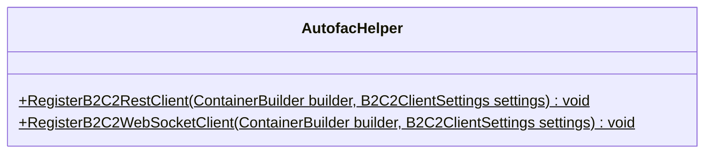

<div id="B2C2RestClient-class-diagram"></div>

##### `B2C2RestClient` class diagram

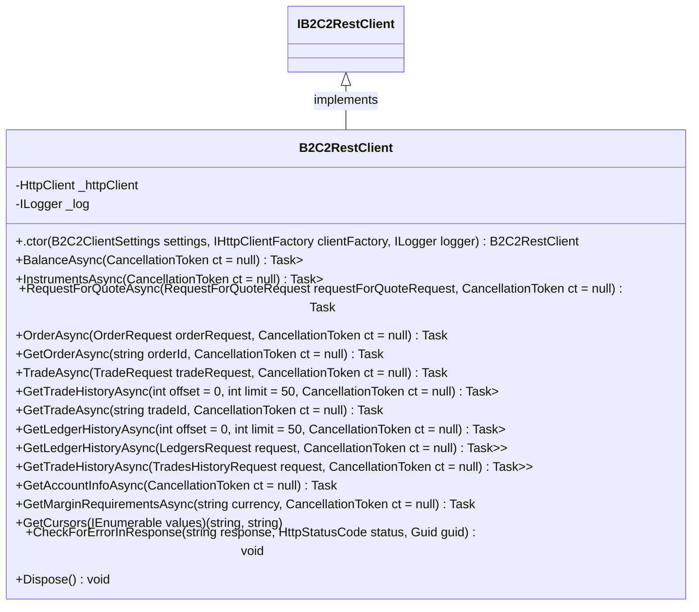

<div id="B2C2WebSocketClient-class-diagram"></div>

##### `B2C2WebSocketClient` class diagram

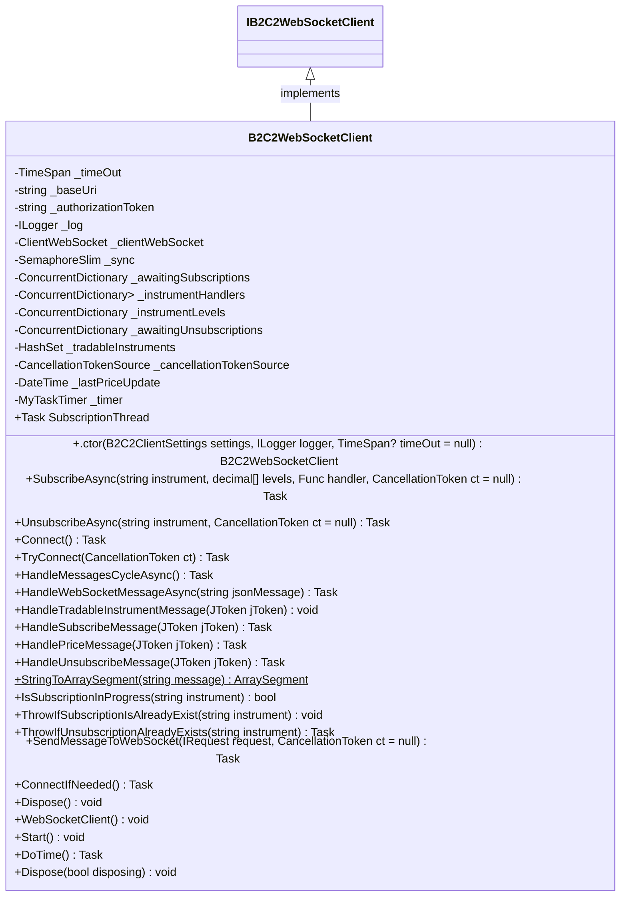

<div id="IB2C2RestClient-class-diagram"></div>

##### `IB2C2RestClient` class diagram

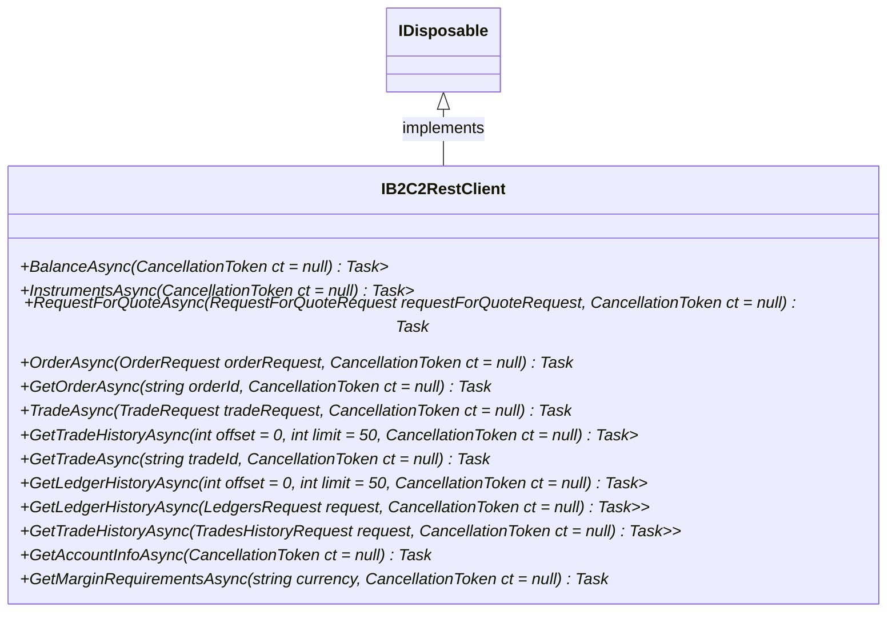

<div id="IB2C2WebSocketClient-class-diagram"></div>

##### `IB2C2WebSocketClient` class diagram

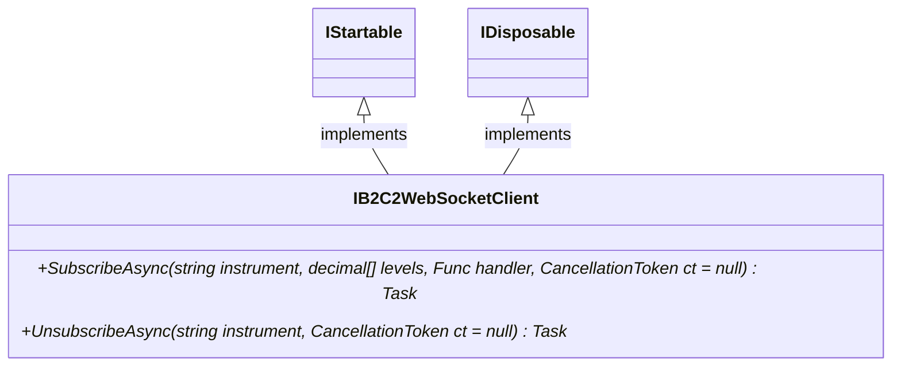

<div id="B2C2WebSocketClient.Subscription-class-diagram"></div>

##### `B2C2WebSocketClient.Subscription` class diagram

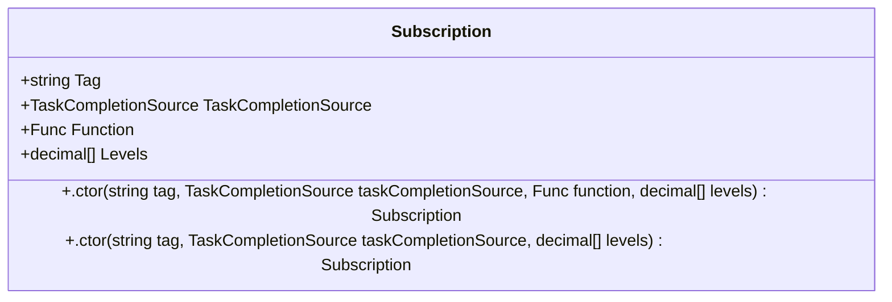

<div id="B2C2DateTimeConverter-class-diagram"></div>

##### `B2C2DateTimeConverter` class diagram

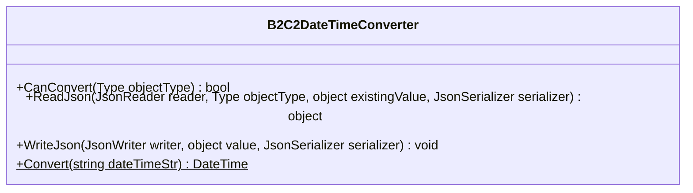

<div id="UnixDateTimeFromMillisecondsConverter-class-diagram"></div>

##### `UnixDateTimeFromMillisecondsConverter` class diagram

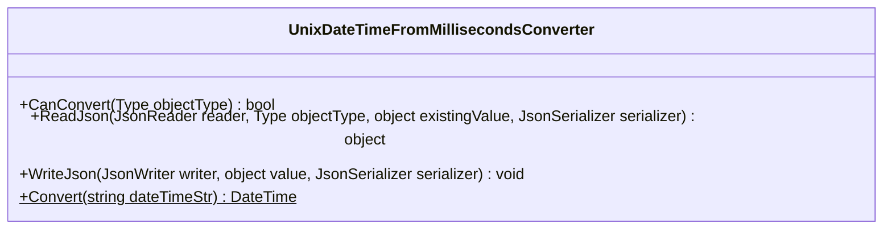

<div id="DelegateHandlerLogger-class-diagram"></div>

##### `DelegateHandlerLogger` class diagram

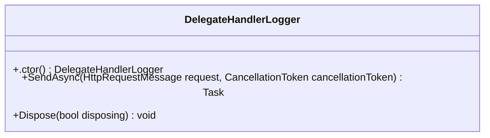

<div id="B2c2RestException-class-diagram"></div>

##### `B2c2RestException` class diagram

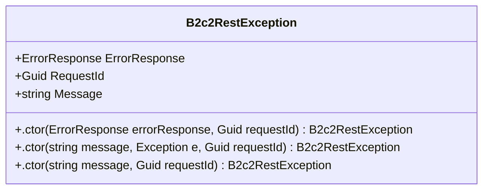

<div id="B2c2WebSocketException-class-diagram"></div>

##### `B2c2WebSocketException` class diagram

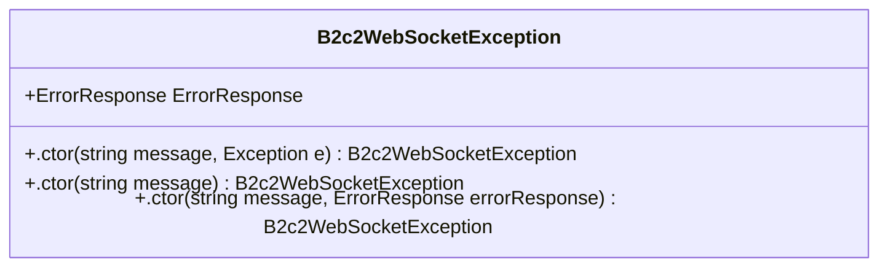

<div id="AccountInfo-class-diagram"></div>

##### `AccountInfo` class diagram

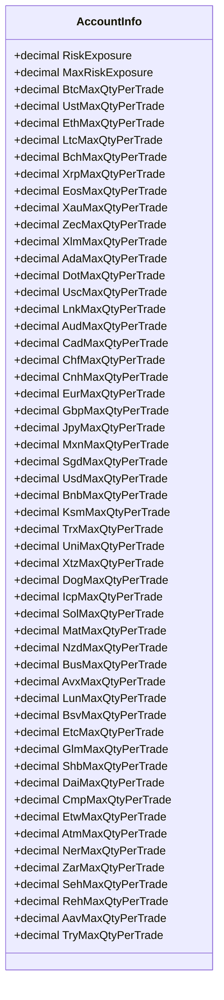

<div id="Error-class-diagram"></div>

##### `Error` class diagram

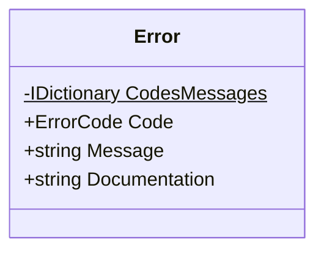

<div id="ErrorCode-class-diagram"></div>

##### `ErrorCode` class diagram

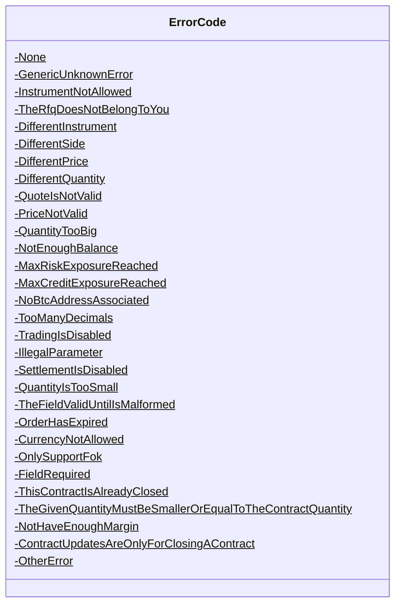

<div id="ErrorResponse-class-diagram"></div>

##### `ErrorResponse` class diagram

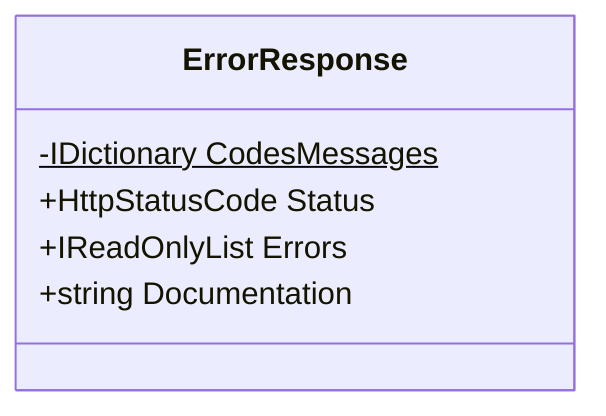

<div id="Instrument-class-diagram"></div>

##### `Instrument` class diagram

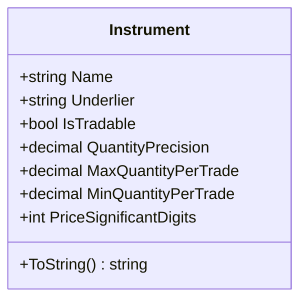

<div id="LedgerLog-class-diagram"></div>

##### `LedgerLog` class diagram

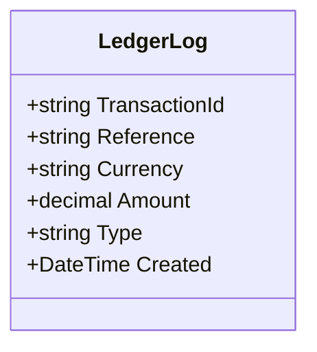

<div id="LedgersRequest-class-diagram"></div>

##### `LedgersRequest` class diagram

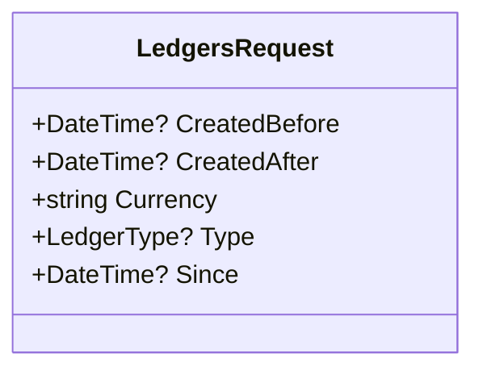

<div id="LedgerType-class-diagram"></div>

##### `LedgerType` class diagram

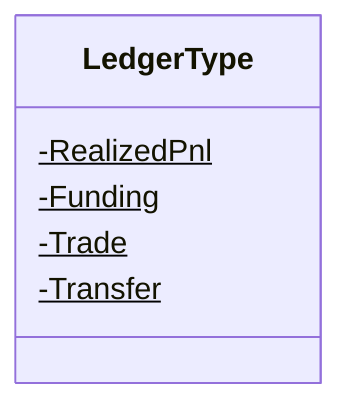

<div id="MarginRequirements-class-diagram"></div>

##### `MarginRequirements` class diagram

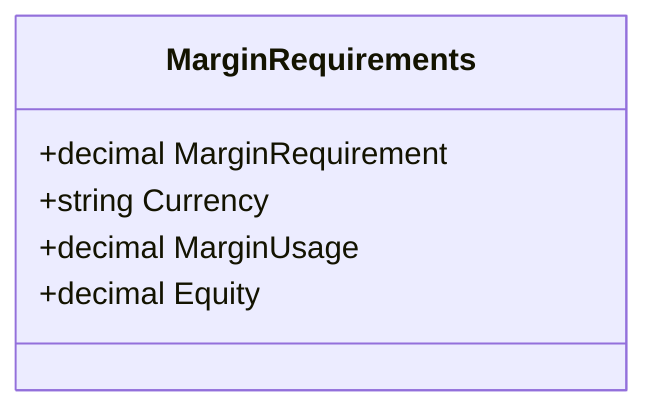

<div id="OpenPosition-class-diagram"></div>

##### `OpenPosition` class diagram

```mermaid
classDiagram
class OpenPosition{
    +string Instrument
    +Side Side
    +decimal AverageEntryPrice
    +decimal AggregatePosition
}

```

<div id="OrderRequest-class-diagram"></div>

##### `OrderRequest` class diagram

```mermaid
classDiagram
class OrderRequest{
    +string ClientOrderId
    +string Instrument
    +Side Side
    +decimal? Price
    +decimal Quantity
    +OrderType OrderType
    +bool? ForceOpen
    +DateTime ValidUntil
    +int AcceptableSlippage
    +string ExecutingUnit
}

```

<div id="OrderResponse-class-diagram"></div>

##### `OrderResponse` class diagram

```mermaid
classDiagram
class OrderResponse{
    +string OrderId
    +string ClientOrderId
    +string Instrument
    +Side Side
    +decimal? Price
    +decimal ExecutedPrice
    +decimal Quantity
    +IReadOnlyCollection<Trade> Trades
    +DateTime Created
}

```

<div id="OrderType-class-diagram"></div>

##### `OrderType` class diagram

```mermaid
classDiagram
class OrderType{
    -None$
    -FOK$
    -MKT$
}

```

<div id="PaginationRequest-class-diagram"></div>

##### `PaginationRequest` class diagram

```mermaid
classDiagram
class PaginationRequest{
    +string Cursor
    +int Limit
}

```

<div id="PaginationResponse&lt;T&gt;-class-diagram"></div>

##### `PaginationResponse<T>` class diagram

```mermaid
classDiagram
class PaginationResponse<T>{
    +T Data
    +string Previous
    +string Next
}

```

<div id="RequestForQuoteRequest-class-diagram"></div>

##### `RequestForQuoteRequest` class diagram

```mermaid
classDiagram
class RequestForQuoteRequest{
    +string ClientRfqId
    +string Instrument
    +Side Side
    +decimal Quantity
    +.ctor() RequestForQuoteRequest
    +.ctor(string instrument, Side side, decimal quantity) RequestForQuoteRequest
}

```

<div id="RequestForQuoteResponse-class-diagram"></div>

##### `RequestForQuoteResponse` class diagram

```mermaid
classDiagram
class RequestForQuoteResponse{
    +string Id
    +string ClientRfqId
    +string Instrument
    +Side Side
    +decimal Price
    +decimal Quantity
    +DateTime ValidUntil
    +.ctor() RequestForQuoteResponse
    +.ctor(string id, string clientRfqId, string instrument, Side side, double price, double quantity, DateTime validUntil) RequestForQuoteResponse
}

```

<div id="Side-class-diagram"></div>

##### `Side` class diagram

```mermaid
classDiagram
class Side{
    -None$
    -Buy$
    -Sell$
}

```

<div id="Trade-class-diagram"></div>

##### `Trade` class diagram

```mermaid
classDiagram
class Trade{
    +string TradeId
    +string RfqId
    +string Instrument
    +Side Side
    +decimal Price
    +decimal Quantity
    +string Order
    +DateTime Created
    +.ctor() Trade
    +.ctor(string tradeId, string rfqId, string instrument, Side side, double price, double quantity, string order, DateTime created) Trade
}

```

<div id="TradeLog-class-diagram"></div>

##### `TradeLog` class diagram

```mermaid
classDiagram
class TradeLog{
    +string TradeId
    +string RequestForQuoteId
    +decimal Volume
    +string Direction
    +string AssetPair
    +decimal Price
    +string User
    +DateTime Created
    +string Order
}

```

<div id="TradeRequest-class-diagram"></div>

##### `TradeRequest` class diagram

```mermaid
classDiagram
class TradeRequest{
    +string Id
    +string Instrument
    +Side Side
    +decimal Price
    +decimal Quantity
    +.ctor() TradeRequest
    +.ctor(RequestForQuoteResponse requestForQuoteResponse) TradeRequest
}

```

<div id="TradesHistoryRequest-class-diagram"></div>

##### `TradesHistoryRequest` class diagram

```mermaid
classDiagram
class TradesHistoryRequest{
    +DateTime? CreatedBefore
    +DateTime? CreatedAfter
    +string Instrument
    +DateTime? Since
}

```

<div id="B2C2ClientSettings-class-diagram"></div>

##### `B2C2ClientSettings` class diagram

```mermaid
classDiagram
class B2C2ClientSettings{
    +string Url
    +string AuthorizationToken
    +.ctor(string url, string authorizationToken) B2C2ClientSettings
}

```

<div id="ClientNames-class-diagram"></div>

##### `ClientNames` class diagram

```mermaid
classDiagram
class ClientNames{
    -string B2C2ClientName$
}

```

<div id="ConnectResponse-class-diagram"></div>

##### `ConnectResponse` class diagram

```mermaid
classDiagram
class ConnectResponse{
    +string Event
    +IReadOnlyList<string> Instruments
    +bool Success
}

```

<div id="ErrorCode-class-diagram"></div>

##### `ErrorCode` class diagram

```mermaid
classDiagram
class ErrorCode{
    -None$
    -AuthenticationFailure$
    -AuthorizationNotInTheHeaders$
    -EndpointDoesNotExist$
    -InstrumentIsNotAllowed$
    -SubscriptionIsInvalid$
    -UnableToJsoniseYourMessage$
    -AlreadyConnected$
    -AlreadySubscribed$
    -NotSubscribedYet$
    -InvalidFormat$
    -InvalidMessage$
    -NotAbleToQuoteAtTheMoment$
    -UnexpectedError$
    -UsernameChanged$
    -ConnectivityIssues$
    -AuthorizationHeaderIsMalformed$
    -SubscriptionForALevelIsNotValidAnymore$
    -TheGivenInstrumentDoesNotEndWithSpotOrCfd$
    -GenericError$
}

```

<div id="ErrorResponse-class-diagram"></div>

##### `ErrorResponse` class diagram

```mermaid
classDiagram
class ErrorResponse{
    -IDictionary<int, string> CodesMessages$
    +string Event
    +bool Success
    +string Tag
    +ErrorCode Code
    +string Message
    +Errors Errors
    +string Documentation
}

```

<div id="Errors-class-diagram"></div>

##### `Errors` class diagram

```mermaid
classDiagram
class Errors{
    +string[] Instrument
    +string[] Levels
}

```

<div id="IRequest-class-diagram"></div>

##### `IRequest` class diagram

```mermaid
classDiagram
class IRequest{
}

```

<div id="Levels-class-diagram"></div>

##### `Levels` class diagram

```mermaid
classDiagram
class Levels{
    +IReadOnlyList<QuantityPrice> Buy
    +IReadOnlyList<QuantityPrice> Sell
}

```

<div id="PriceMessage-class-diagram"></div>

##### `PriceMessage` class diagram

```mermaid
classDiagram
class PriceMessage{
    +Levels Levels
    +string Instrument
    +string Event
    +bool Success
    +DateTime Timestamp
}

```

<div id="QuantityPrice-class-diagram"></div>

##### `QuantityPrice` class diagram

```mermaid
classDiagram
class QuantityPrice{
    +decimal Quantity
    +decimal Price
    +.ctor(double quantity, double price) QuantityPrice
}

```

<div id="SubscribeMessage-class-diagram"></div>

##### `SubscribeMessage` class diagram

```mermaid
classDiagram
class SubscribeMessage{
    +string Event
    +string Instrument
    +decimal[] Levels
    +string Tag
    +bool Success
}

```

<div id="SubscribeRequest-class-diagram"></div>

##### `SubscribeRequest` class diagram

```mermaid
classDiagram
IRequest <|-- SubscribeRequest : implements
class SubscribeRequest{
    +string Event
    +string Instrument
    +decimal[] Levels
    +string Tag
}

```

<div id="UnsubscribeMessage-class-diagram"></div>

##### `UnsubscribeMessage` class diagram

```mermaid
classDiagram
class UnsubscribeMessage{
    +string Event
    +string Instrument
    +string Tag
    +bool Success
}

```

<div id="UnsubscribeRequest-class-diagram"></div>

##### `UnsubscribeRequest` class diagram

```mermaid
classDiagram
IRequest <|-- UnsubscribeRequest : implements
class UnsubscribeRequest{
    +string Event
    +string Instrument
    +string Tag
}

```

<div id="Program-class-diagram"></div>

##### `Program` class diagram

```mermaid
classDiagram
class Program{
    +Main(string[] args)$ Task
    +Print(object obj)$ void
}

```

*This file is maintained by a bot.*

<!-- markdownlint-restore -->
